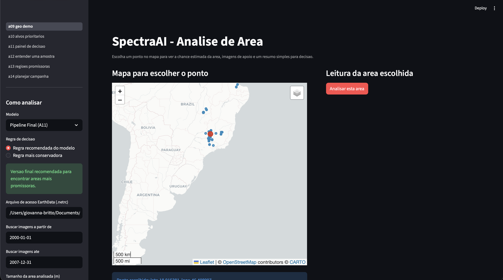
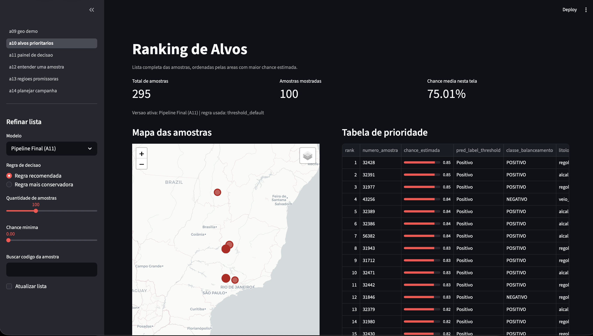
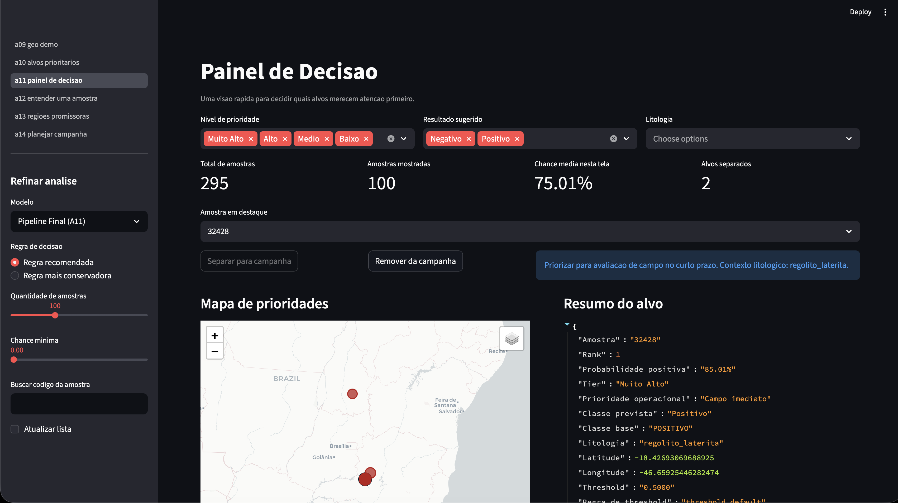
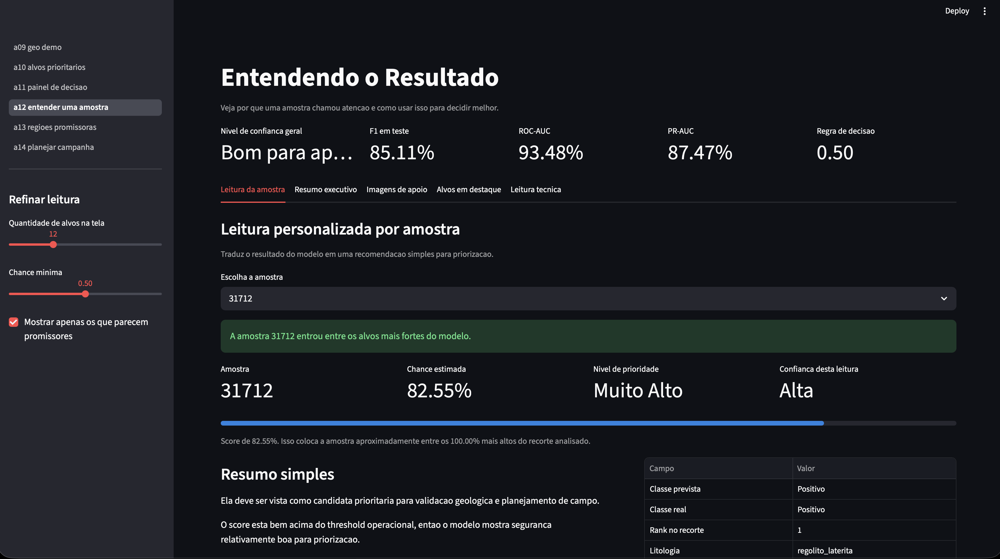
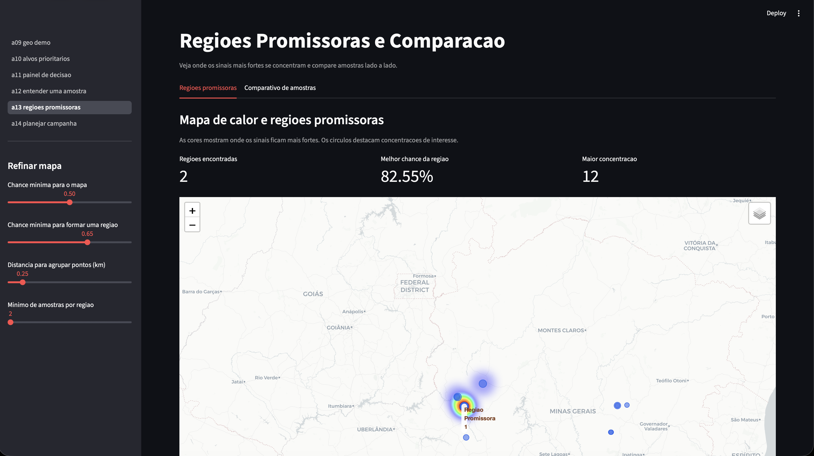
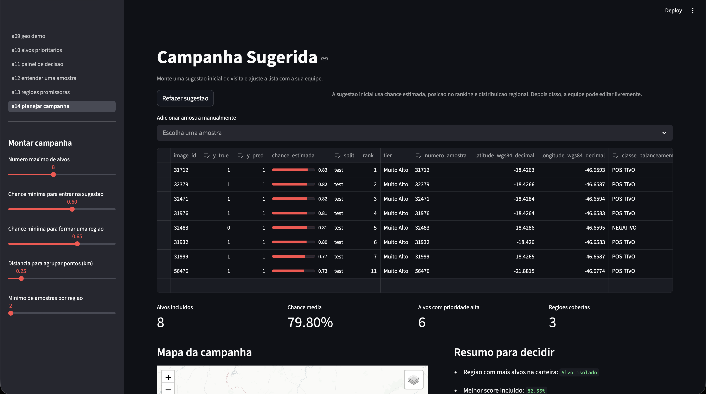

<!-- ===================================================== -->
<!-- HEADER INSTITUCIONAL – TEMPLATE INTELI -->
<!-- ===================================================== -->
<p align="center">
  <a href="https://www.inteli.edu.br/">
    
  </a>
  &nbsp;&nbsp;&nbsp;&nbsp;&nbsp;&nbsp;&nbsp;&nbsp;
  <a href="https://www.fronteraminerals.com/">
    
  </a>
</p>


<h1 align="center">
SpectraAI — Sistema de Deep Learning para mapeamento de prospectividade de Terras Raras usando imagens de satélite
</h1>

<p align="center">
<b>Curso:</b> Ciência da Computação — Inteli<br>
<b>Módulo 09:</b> Deep Learning & Visão Computacional
</p>

<p align="center"><i>
Projeto acadêmico desenvolvido em parceria com a Frontera Minerals
</i></p>

---

## Sumário

- [Grupo](#-grupo)
- [Integrantes](#-integrantes)
- [Descrição do Projeto](#-descrição-do-projeto)
- [Objetivos do Módulo](#-objetivos-do-módulo)
- [Objetivos do Projeto](#-objetivos-do-projeto)
- [Estrutura do Repositório](#-estrutura-do-repositório)
- [Entrega A11](#entrega-a11)
- [Regras do Projeto](#-regras-do-projeto)
- [Como Executar](#️-como-executar)
- [Tutorial em Vídeo](#️-tutorial-em-vídeo)
- [Aplicação Interativa](#️-aplicação-interativa)
- [Artefatos por Sprint](#-artefatos-por-sprint)
- [Boas Práticas de Trabalho em Equipe](#-boas-práticas-de-trabalho-em-equipe)
- [Tecnologias](#-tecnologias)
- [Reprodutibilidade](#-reprodutibilidade)
- [Licença](#-licença)

---

## 👥 Grupo
**g01 — SpectraAI**

---

## 👨‍🎓 Integrantes:
- Drielly Farias
- Eduardo Rizk
- Giovanna Vieira
- Larissa Souza
- Lucas Jorge
- Mateus Pereira
- Pedro Auler

## 👩‍🏫 Professores:
### Orientador(a)
- Ana Cristina dos Santos
### Instrutores
- Cesar Cavini Almiñana
- Filipe Gonçalves de Souza Nogueira da Silva
- Pedro Marins Freire Teberga
- Maria Cristina Nogueira Gramani
- Jose Erinaldo da Fonseca
- Rodolfo Riyoei Goya

---

## 📜 Descrição do Projeto

O projeto SpectraAI busca identificar áreas com potencial de ocorrência de Terras Raras a partir de dados multiespectrais de satélite (ASTER), reduzindo incerteza operacional na priorização de alvos de prospecção para a Frontera Minerals.

A abordagem técnica combina pipeline de dados geoespaciais, construção de dataset para modelagem supervisionada, baselines clássicos de Machine Learning e evolução para modelos de Deep Learning, sempre com protocolo experimental reprodutível e comparação objetiva por métricas.

---

## 🎯 Objetivos do Módulo

Ao final deste módulo, o grupo deverá ser capaz de:

- aplicar técnicas de Visão Computacional e Deep Learning em um problema real
- construir e comparar modelos baseline e modelos avançados
- conduzir avaliação experimental com métricas adequadas
- garantir reprodutibilidade do pipeline (do dado ao resultado)
- documentar decisões técnicas de forma clara e estruturada
- produzir um artigo científico no formato SBC

---
## 🎯 Objetivos do Projeto

Defina metas técnicas claras e mensuráveis para o seu sistema.

- construir e validar um baseline clássico robusto para classificação (A02)
- comparar de forma justa modelos clássicos e modelos de Deep Learning nas sprints seguintes
- manter pipeline reprodutível com avaliação em treino/validação/teste e análise crítica de erros


## 📁 Estrutura do Repositório

```bash
├── artefatos/             # entregas formais de cada sprint
├── artigo/                # artigo científico (markdown + PDF)
│   └── figuras/           # figuras do artigo
├── src/                   # código modular reutilizável (.py)
│   ├── apps/              # aplicações interativas (Streamlit)
│   ├── evaluation/        # módulo de avaliação de modelos
│   └── tests/             # testes automatizados (pytest)
├── notebooks/             # exploração, experimentos e narrativa
├── docs/                  # documentação técnica auxiliar
│   ├── flowchart.md       # diagrama de fluxo da arquitetura
│   └── normalization_docs.md
├── data/                  # dados de entrada
├── models/                # modelos treinados/checkpoints
│   └── trained_models/    # experimentos de treino (configs e histórico)
├── outputs/               # resultados gerados automaticamente
│   ├── figures/           # gráficos e visualizações
│   ├── metrics/           # métricas e JSONs de avaliação
│   └── predictions/       # predições exportadas
├── scripts/               # utilitários de execução e automação
│   └── run_pipeline.py    # entrypoint iterativo de desenvolvimento
├── slides/                # apresentações do projeto (Review_SprintN.pdf)
├── assets/                # imagens, logos e recursos estáticos
├── Makefile
├── requirements.txt       # dependências de produção
├── requirements-dev.txt   # dependências de desenvolvimento (pytest, etc.)
└── README.md
```

---

## Entrega A11

A entrega final reproduzivel do pipeline end-to-end esta em
`artefatos/a11_pipeline_e2e/`.

> **Nota:** `scripts/run_pipeline.py` e um utilitario de desenvolvimento
> para experimentos iterativos. O entrypoint oficial da entrega A11 e
> `artefatos/a11_pipeline_e2e/main.py`, executado via modulo conforme
> documentado abaixo.

- README oficial do artefato: `artefatos/a11_pipeline_e2e/README.md`
- comando oficial:

```bash
python3 -m pip install -r artefatos/a11_pipeline_e2e/requirements.txt

python3 -m artefatos.a11_pipeline_e2e \
  --config artefatos/a11_pipeline_e2e/config.yaml
```

---

## 📌 Regras do Projeto

### 📘 notebooks/
- narrativa experimental
- exploração de dados (EDA)
- testes rápidos e análises
- **não concentrar lógica principal aqui**

### 🐍 src/
- funções reutilizáveis
- pipelines de processamento
- treino e inferência
- código organizado e modular

### 🧠 models/
- pesos e checkpoints leves
- versões finais dos modelos
- **evitar arquivos muito grandes (>100MB)**

### 📊 outputs/
- métricas
- gráficos
- tabelas
- resultados de experimentos
- **podem ser regenerados → evitar versionar arquivos temporários**

### 📄 artigo/
- artigo.md (fonte)
- artigo_sbc.pdf (exportado)

### ⚠️ Não versionar
- datasets grandes
- dados brutos sensíveis
- checkpoints gigantes
- outputs temporários
- arquivos intermediários
---

## ▶️ Como Executar

### 1️⃣ Clonar repositório
```bash
git clone <url-do-repo>
cd <repo>
```

### 2️⃣ Criar ambiente
```bash
python3 -m venv venv
source venv/bin/activate
python -m pip install -U pip
# produção
python -m pip install -r requirements.txt
# desenvolvimento (inclui pytest, pytest-cov)
python -m pip install -r requirements-dev.txt
```

### 3️⃣ Executar testes
```bash
make test
```

### 4️⃣ Executar notebooks
```bash
jupyter notebook
```

### 5️⃣ Executar pipeline iterativo de desenvolvimento
```bash
python scripts/run_pipeline.py
```

> Para a entrega oficial reprodutível (A11), use o comando abaixo (ver [Entrega A11](#entrega-a11)):
> ```bash
> python3 -m artefatos.a11_pipeline_e2e --config artefatos/a11_pipeline_e2e/config.yaml
> ```

### 6️⃣ Executar baseline clássico (A02)
```bash
jupyter notebook artefatos/a02_baseline_classico/a02_baseline_classico.ipynb
```

### 6️⃣ Executar pipeline final (A11) e consolidar métricas

#### Opção A: Usar Makefile (recomendado)
```bash
# Executar o pipeline completo do A11
make run-a11

# Consolidar métricas em CSV padronizado
make consolidate-a11-metrics

# Resultado: outputs/a11_metrics_final.csv
```

#### Opção B: Executar manualmente
```bash
# Rodar o pipeline A11
python -m artefatos.a11_pipeline_e2e --config artefatos/a11_pipeline_e2e/config.yaml

# Consolidar métricas do A11 em formato padronizado
python scripts/consolidate_a11_metrics.py

# Resultado: 
#   - outputs/a11_metrics_final.csv (formato tabulado)
#   - outputs/a11_metrics_final.json (formato estruturado)
```

**Saída gerada pelo A11:**
| Arquivo | Localização | Descrição |
|---------|------------|-----------|
| `summary.json` | `artefatos/a11_pipeline_e2e/outputs/metrics/` | Resumo completo: métricas, configuração, timestamps |
| `summary.csv` | `artefatos/a11_pipeline_e2e/outputs/metrics/` | Idem em CSV |
| `best_model.keras` | `artefatos/a11_pipeline_e2e/outputs/models/` | Pesos do modelo treinado (~19 MB) |
| `history.json` | `artefatos/a11_pipeline_e2e/outputs/models/` | Histórico de loss/accuracy por época |
| `test_predictions.csv` | `artefatos/a11_pipeline_e2e/outputs/predictions/` | Predições no conjunto de teste |

**Métricas consolidadas pelo script:**
```
Acurácia:           0.8814
Precisão:           0.8333
Recall:             0.8696
F1-Score:           0.8511
ROC-AUC:            0.9348
PR-AUC:             0.8747
Balanced Accuracy:  0.8792
```

---

## 🎥 Tutorial em Vídeo

Foi gravado um vídeo único com a visão geral do repositório, preparação do
ambiente e execução dos principais fluxos do projeto:

- Tutorial completo: https://drive.google.com/file/d/1fz1Mr6LvjvfNqrbxKkp4UlPtv_lIauFt/view?usp=sharing

> Este vídeo pode ser usado como material principal de onboarding do projeto. Ele cobre a estrutura do repositório, a instalação do ambiente e a execução dos códigos mais importantes.

---

## 🖥️ Aplicação Interativa

Além do pipeline oficial do A11, o projeto inclui uma aplicação em Streamlit
para exploração visual, leitura dos alvos e apoio à decisão.

### Como abrir o app

Da raiz do repositório:

```bash
streamlit run src/apps/a09_geo_demo.py
```

Se houver problema com backend gráfico:

```bash
MPLBACKEND=Agg streamlit run src/apps/a09_geo_demo.py
```

### O que existe no app

- `Mapa de Analise`: permite escolher um ponto no mapa e analisar a área com o modelo final.
- `Alvos Prioritarios`: lista todas as amostras ordenadas pelas áreas com maior chance estimada.
- `Painel de Decisao`: ajuda a separar alvos para campanha com filtros e shortlist.
- `Entender Uma Amostra`: mostra explicação por amostra, com linguagem simples e Grad-CAM individual.
- `Regioes Promissoras`: mostra mapa de calor, agrupamentos geográficos e comparação entre amostras.
- `Planejar Campanha`: gera uma campanha sugerida e permite editar prioridades, status e notas.

### Fluxo recomendado para demonstração

1. Abra `Mapa de Analise` para mostrar a leitura de uma área escolhida no mapa.
2. Vá para `Alvos Prioritarios` para ver o ranking completo da base.
3. Use `Painel de Decisao` para separar alvos de interesse.
4. Mostre `Entender Uma Amostra` para explicar por que um alvo chamou atenção.
5. Mostre `Regioes Promissoras` para destacar clusters e mapa de calor.
6. Finalize em `Planejar Campanha` com a sugestão editável de visita a campo.

### Campos para inserir imagens das telas

Use os blocos abaixo para inserir screenshots finais no README:

### Tela Inicial e Pipeline por Coordenada



### Ranking Probabilístico das Amostras



### Painel de Decisão das Amostras e Regiões



### Explicabilidade dos Resultados das Amostras



### Definição de Regiões Promissoras



### Planejamento de Campanha



---

## 📊 Artefatos por Sprint

### Sprint 1 — Entendimento do problema e baseline clássico
- Análise exploratória dos dados (EDA)
- Pipeline inicial de pré-processamento
- Implementação e avaliação de baseline clássico (ML tradicional)

### Sprint 2 — Baseline Deep Learning
- Implementação de rede densa (MLP)
- Avaliação experimental comparativa (baseline clássico × MLP)
- Artigo científico — Versão 1 (fundamentação e metodologia inicial)

#### Entrega 2B — Funções de ativação da MLP
- `ReLU` nas camadas ocultas: acelera convergência e reduz saturação de gradiente.
- `Sigmoid` na saída para classificação binária: gera probabilidade no intervalo `[0, 1]`.
- `Softmax` na saída para classificação multiclasse: normaliza probabilidades para soma 1 entre classes.
- Implementação em: `src/models/mlp_activations.py`.

### Sprint 3 — CNN e análise de desempenho
- Implementação de CNN simples
- Avaliação experimental ampliada
- Técnicas de interpretabilidade dos modelos
- Artigo científico — Versão 2 (metodologia refinada)

### Sprint 4 — Transfer Learning e consolidação
- Modelo avançado com Transfer Learning e data augmentation
- Integração parcial do pipeline end-to-end
- Consolidação dos resultados experimentais
- Artigo científico — Versão 3 (resultados parciais)

### Sprint 5 — Entrega final
- Pipeline completo reprodutível (end-to-end)
- Artigo científico final no template SBC
- Apresentação técnica do projeto ao parceiro

---

## 🤝 Boas Práticas de Trabalho em Equipe

Este projeto adota práticas profissionais de engenharia e pesquisa.
Espera-se que o time:

### 📌 Organização técnica
- manter commits frequentes e descritivos
- versionar todas as entregas
- documentar decisões no notebook ou README
- manter código modular e reutilizável

### 📌 Colaboração
- dividir tarefas de forma equilibrada
- participar das cerimônias (Planning, Review, Retro)
- registrar decisões e experimentos
- garantir que todos compreendam o pipeline completo

### 📌 Qualidade
- resultados reprodutíveis
- notebooks narrativos (storytelling técnico)
- métricas claras e comparáveis
- estrutura de pastas padronizada

> 💡 Essas práticas impactam diretamente o desempenho individual e coletivo no módulo.

---

## 📚 Tecnologias
- Python
- Scikit-Learn
- Pandas / NumPy
- Matplotlib / Seaborn
- Rasterio / PyProj
- Jupyter Notebook

---

## 🧪 Reprodutibilidade

Todos os experimentos devem:
- ✅ rodar do zero em nova máquina
- ✅ usar seeds fixas
- ✅ salvar métricas e gráficos em `/outputs`
- ✅ documentar hipóteses e resultados no notebook
- ✅ permitir replicação por outro grupo

---

## 📄 Licença

Este repositório destina-se exclusivamente a fins acadêmicos e educacionais no contexto do curso de Ciência da Computação do Inteli.

A reutilização total ou parcial do código, dados ou materiais deve respeitar as políticas institucionais do Inteli e eventuais restrições acordadas com o parceiro do projeto.

---

✨ **Inteli — Instituto de Tecnologia e Liderança**
