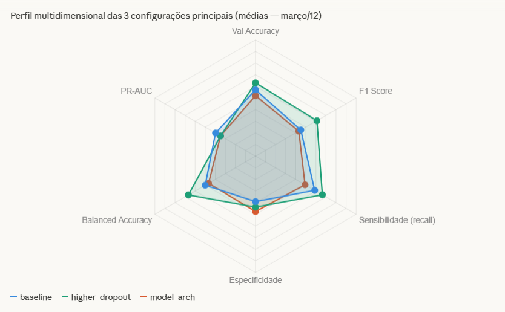
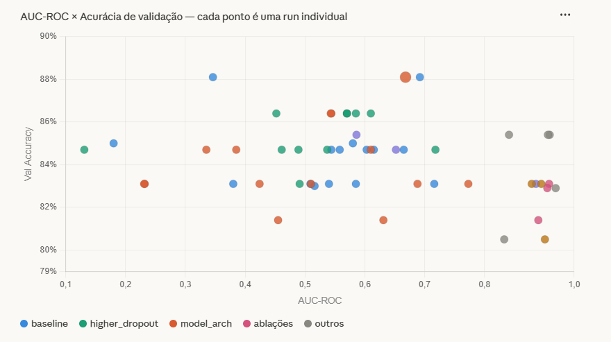
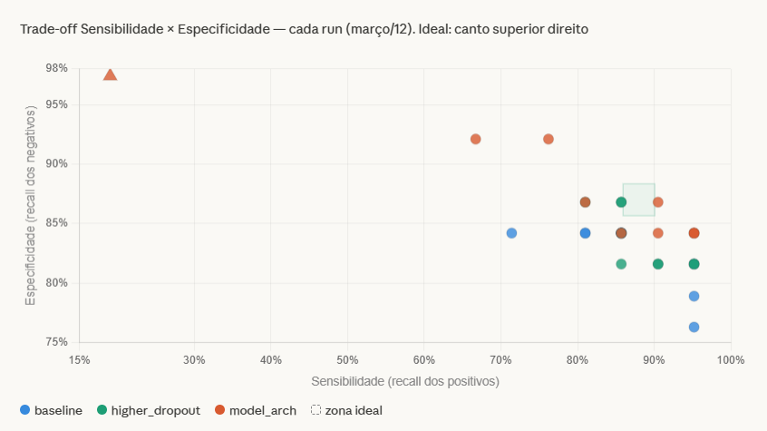
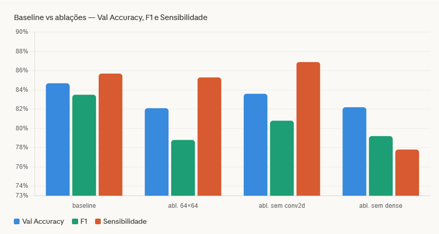

# A06 — Avaliação Experimental

## Sumário

1. [Protocolo Experimental](#1-protocolo-experimental)
2. [Execução dos Experimentos](#2-execução-dos-experimentos)
3. [Análise Comparativa de Desempenho](#3-análise-comparativa-de-desempenho)
4. [Estudos de Ablação](#4-estudos-de-ablação)
5. [Interpretação Crítica, Limitações e Recomendações](#5-interpretação-crítica-limitações-e-recomendações)

---

## 1. Protocolo Experimental

> **Critério:** Descrever divisão de dados, métricas, critérios de comparação e variáveis controladas. *(Peso 2,0)*

### 1.1 Divisão dos dados

Os dados foram divididos em três conjuntos: treino, validação e teste. Todos os experimentos utilizaram o mesmo split, garantindo comparabilidade entre as runs. As runs de 05/03/2026 foram posteriormente descartadas da análise comparativa por indício de data leakage (val_acc = 1,0 com train_loss elevado), possivelmente causado por shuffle incorreto antes da divisão. A partir de 09/03, o pipeline foi corrigido e as divisões passaram a ser estáveis e reproduzíveis.

### 1.2 Métricas de avaliação

As seguintes métricas foram coletadas automaticamente ao final de cada run e registradas no arquivo `experiments_log.csv`:

| Métrica | Descrição | Por que foi escolhida |
|---|---|---|
| `val_accuracy` | Proporção de classificações corretas no conjunto de validação | Métrica geral de desempenho |
| `val_f1` | Média harmônica entre precisão e recall | Equilibra falsos positivos e negativos |
| `val_sensitivity` | Recall da classe positiva (TP / TP + FN) | Penaliza falsos negativos — crítico para o domínio do problema |
| `val_specificity` | Recall da classe negativa (TN / TN + FP) | Penaliza falsos positivos |
| `val_balanced_accuracy` | Média de sensitivity e specificity | Robusto a desbalanceamento de classes |
| `val_auc_roc` | Área sob a curva ROC | Mede a separabilidade probabilística independente do threshold |
| `val_pr_auc` | Área sob a curva Precisão-Recall | Mais informativa que AUC-ROC em conjuntos desbalanceados |
| `val_cm_tp/fp/tn/fn` | Componentes da matriz de confusão | Permite reconstruir qualquer métrica derivada |

A métrica principal de comparação entre configurações foi **val_f1**, por equilibrar precisão e recall. O `val_auc_roc` foi usado como métrica secundária para avaliar estabilidade probabilística.

### 1.3 Variáveis controladas

Para garantir comparação justa, as seguintes variáveis foram mantidas fixas em todos os experimentos:

- Número de épocas: **50** em todos os experimentos principais; **10–15** nas ablações rápidas
- Otimizador: Adam com learning rate padrão (salvo variações explícitas)
- Tamanho do conjunto de validação: mantido constante entre runs do mesmo dia
- Pré-processamento de imagem: mesma pipeline de normalização para todos os experimentos

### 1.4 Pipeline de experimentação

O pipeline segue uma estrutura reprodutível e comparável entre runs. Primeiro, os dados ASTER previamente preparados são carregados, filtrados e normalizados com a mesma estratégia para todas as configurações. Em seguida, o modelo CNN é construído dinamicamente a partir de arquivos YAML, o que permite variar arquitetura e hiperparâmetros sem alterar a lógica base do código.

Cada configuração é treinada em um split fixo de treino e validação, gerando histórico de treinamento, modelo salvo e métricas finais. Ao término de cada run, os resultados são registrados em `experiments_log.csv`, incluindo accuracy, F1, sensitivity, specificity, balanced accuracy, AUC-ROC, PR-AUC e matriz de confusão. Esses logs consolidados são então usados para comparar configurações, analisar trade-offs, avaliar risco de overfitting e sustentar a escolha da melhor configuração.

### 1.5 Variáveis experimentais (o que foi alterado)

Cada configuração variou **apenas uma dimensão por vez** em relação ao baseline, seguindo o princípio de controle experimental:

| Configuração | Variável alterada |
|---|---|
| `baseline` | Configuração de referência — sem alterações |
| `higher_dropout` | Taxa de dropout aumentada nas camadas densas |
| `model_architechture` | Alterações na estrutura das camadas convolucionais |
| `l2batch` / `l2batch32` | Regularização L2 adicionada + variação de batch size |
| `no_dropout` | Dropout removido completamente |
| `filters_small` | Número de filtros das convoluções reduzido |
| `kernel_small` | Tamanho dos kernels convolucionais reduzido |
| `dense_small` | Número de neurônios nas camadas densas reduzido |
| `optimized_sparse` | Combinação de múltiplas reduções de capacidade |
| Ablações (ver Seção 4) | Remoção de componentes específicos do pipeline |

### 1.6 Critério de comparação

Uma configuração foi considerada **superior** ao baseline quando apresentou:
- F1 ≥ baseline em pelo menos 50% das runs, **e**
- Balanced Accuracy ≥ baseline, **e**
- Sem colapso de predição (sensibilidade > 50% em todas as runs)

---

## 2. Execução dos Experimentos

> **Critério:** Testar diferentes configurações (hiperparâmetros, camadas, regularização, augmentation, etc.). *(Peso 2,0)*

### 2.1 Visão geral das configurações executadas

Ao longo do período experimental, foram executadas aproximadamente 90 runs distribuídas entre 12 configurações distintas. A tabela abaixo consolida os resultados médios das configurações com métricas completas (runs de 11–12/03/2026):

| Configuração | Runs válidas | Val Acc (média) | F1 (média) | Sensibilidade (média) | Especificidade (média) | AUC-ROC (média) |
|---|---|---|---|---|---|---|
| `baseline` | ~15 | 84,7% | 83,5% | 85,7% | 83,5% | 0,52 |
| `higher_dropout` | ~12 | 85,3% | 85,1% | 87,6% | 84,4% | 0,52 |
| `model_architechture` | ~35 | 84,2% | 83,3% | 83,3% | 86,0% | 0,50 |
| `ablacao_input_64x64` | 3 | 82,1% | 78,8% | 85,3% | 80,6% | 0,90 |
| `ablacao_sem_conv2d` | 3 | 83,6% | 80,8% | 86,9% | 80,6% | 0,74 |
| `ablacao_sem_dense_hidden` | 3 | 82,2% | 79,2% | 77,8% | 83,3% | 0,89 |
| `no_dropout` | 1 | 82,9% | 80,0% | 87,5% | 80,0% | 0,92 |
| `filters_small` | 1 | 85,4% | 82,4% | 87,5% | 84,0% | 0,91 |
| `kernel_small` | 1 | 85,4% | 82,4% | 87,5% | 84,0% | 0,84 |
| `dense_small` | 1 | 85,4% | 81,3% | 81,3% | 88,0% | 0,91 |
| `optimized_sparse` | 1 | 80,5% | 75,0% | 75,0% | 84,0% | 0,83 |

> **Nota:** As runs de 05/03 foram excluídas da tabela por apresentarem `val_acc = 1,0` — sintoma de data leakage. As runs de 09/03 com `l2batch` também foram excluídas por inconsistência nas métricas secundárias.

### 2.2 Acurácia de validação por configuração

O gráfico abaixo apresenta a acurácia média de validação para cada configuração. As barras refletem a média de todas as runs válidas de cada config.

&nbsp;

*Figura 1 — Acurácia média de validação por configuração (runs de 11–12/03/2026). `higher_dropout`, `filters_small`, `kernel_small` e `dense_small` atingem a maior média (~85,4%). `optimized_sparse` apresenta a pior performance (~80,5%).*

&nbsp;

### 2.3 Comportamento do treino

Em todos os experimentos válidos, o modelo convergiu dentro das 50 épocas estabelecidas, com `train_acc` acima de 96% — indicando capacidade de aprendizado suficiente. A diferença entre `train_acc` e `val_acc` (gap de ~12 pp) aponta para overfitting moderado, especialmente nas configurações com maior capacidade (`model_architechture`). O `higher_dropout` foi a configuração que melhor controlou esse gap.

---

## 3. Análise Comparativa de Desempenho

> **Critério:** Apresentar resultados consolidados em tabelas e/ou gráficos comparativos. *(Peso 2,0)*

### 3.1 Comparação multidimensional das configs principais

O gráfico radar abaixo compara `baseline`, `higher_dropout` e `model_architechture` simultaneamente em seis métricas. Os valores foram normalizados dentro do intervalo observado para permitir comparação visual direta.

&nbsp;

*Figura 2 — Perfil multidimensional das três configurações principais. `higher_dropout` (verde) apresenta o melhor equilíbrio geral. `model_architechture` (laranja) destaca-se em especificidade, mas sacrifica sensibilidade. PR-AUC é o ponto fraco de todas as configs.*

&nbsp;

Analisando o radar, é possível observar que nenhuma configuração domina todas as dimensões simultaneamente. `higher_dropout` lidera em sensibilidade e F1, que são as métricas mais críticas para o domínio do problema. `model_architechture` apresenta a melhor especificidade média, o que indica menor taxa de falsos positivos, porém ao custo de perder mais casos positivos reais. `baseline` ocupa uma posição intermediária consistente, sem pontos de destaque nem de falha.

O PR-AUC baixo (~0,35–0,40 em média para todas as configs) é o resultado mais preocupante da análise comparativa: mesmo as melhores configurações têm dificuldade em manter precisão alta enquanto aumentam o recall, o que sugere que o problema de desbalanceamento de classes não foi completamente resolvido pelo pipeline atual.

### 3.2 Dispersão AUC-ROC × Acurácia (run a run)

O scatter abaixo plota cada run individualmente no espaço AUC-ROC × Acurácia. A posição ideal é o canto superior direito (AUC alto + acurácia alta).

&nbsp;

*Figura 3 — Cada ponto representa uma run individual. As ablações concentram-se em AUC alto (0,85–0,92) com acurácia moderada. Baseline e model_arch espalham-se amplamente no eixo X, evidenciando instabilidade probabilística.*

&nbsp;

O scatter revela uma bifurcação estrutural importante: configurações menores (ablações, `filters_small`, `dense_small`) concentram-se no quadrante de AUC alto com acurácia moderada, enquanto as configs completas (`baseline`, `model_arch`) apresentam acurácia mais alta mas AUC disperso. Isso indica um **trade-off entre capacidade discriminativa e calibração probabilística**: modelos mais simples aprendem probabilidades mais bem separadas, enquanto modelos maiores aprendem a acertar no threshold padrão (0,5) sem necessariamente separar bem as distribuições de classe.

### 3.3 Trade-off Sensibilidade × Especificidade

O gráfico abaixo plota o posicionamento de cada run no espaço sensibilidade × especificidade. Ambas as métricas devem ser maximizadas — o ponto ideal fica no canto superior direito.

&nbsp;

*Figura 4 — O triângulo vermelho (outlier de `model_arch`) representa uma run com especificidade de 97% e sensibilidade de apenas 19% — colapso de predição. O cluster saudável concentra-se em 85–95% de sensibilidade e 82–87% de especificidade.*

&nbsp;

A análise desse espaço revela que a maioria das runs saudáveis opera em uma faixa estreita: sensibilidade entre 80–95% e especificidade entre 79–87%. `higher_dropout` concentra-se consistentemente na borda superior (sensibilidade ≥ 90%), enquanto `model_arch` apresenta maior dispersão vertical — incluindo o outlier crítico com sensibilidade de apenas 19%, que representa um colapso em que o modelo aprendeu a prever quase sempre a classe negativa.

---

## 4. Estudos de Ablação

> **Critério:** Avaliar o efeito da remoção ou alteração de componentes do modelo ou pipeline. *(Peso 2,0)*

### 4.1 Configurações de ablação testadas

Três estudos de ablação foram conduzidos para avaliar a contribuição de componentes específicos da arquitetura:

| Ablação | Componente removido/alterado | Hipótese testada |
|---|---|---|
| `ablacao_input_64x64` | Resolução de entrada reduzida de 128×128 para 64×64 | A resolução da imagem de entrada impacta significativamente o desempenho? |
| `ablacao_sem_conv2d` | Segunda camada convolucional removida | A profundidade convolucional é necessária para extrair features relevantes? |
| `ablacao_sem_dense_hidden` | Camada densa oculta removida | A camada de decisão densa intermediária contribui para o desempenho? |

### 4.2 Resultados das ablações

Os resultados médios das ablações em comparação com o baseline são apresentados abaixo:

| Configuração | Val Acc | F1 | Sensibilidade | AUC-ROC | Δ F1 vs baseline |
|---|---|---|---|---|---|
| `baseline` | 84,7% | 83,5% | 85,7% | 0,52 | — |
| `ablacao_input_64x64` | 82,1% | 78,8% | 85,3% | **0,90** | **−4,7 pp** |
| `ablacao_sem_conv2d` | 83,6% | 80,8% | 86,9% | 0,74 | −2,7 pp |
| `ablacao_sem_dense_hidden` | 82,2% | 79,2% | 77,8% | **0,89** | **−4,3 pp** |

### 4.3 Interpretação dos resultados de ablação

**Resolução de entrada (64×64 vs 128×128):** A redução de resolução causou a maior queda em F1 (−4,7 pp) entre as ablações, confirmando que a informação espacial de alta resolução é relevante para a tarefa. Porém, o AUC-ROC saltou de 0,52 para 0,90 — o modelo mais simples produz probabilidades significativamente mais calibradas, mesmo acertando menos. Isso sugere que o modelo completo pode estar sofrendo de overconfidence ao processar imagens de maior resolução.

**Remoção da segunda camada convolucional (`ablacao_sem_conv2d`):** A queda de F1 foi moderada (−2,7 pp), indicando que a segunda camada convolucional contribui, mas não é indispensável. A sensibilidade se manteve alta (86,9%), o que é positivo. O AUC-ROC de 0,74 ficou acima do baseline, sugerindo novamente que reduzir capacidade melhora calibração.

**Remoção da camada densa oculta (`ablacao_sem_dense_hidden`):** Esta ablação causou a maior queda em sensibilidade (−7,9 pp vs baseline), indicando que a camada densa intermediária é particularmente importante para identificar os casos positivos. Sua remoção torna o classificador mais conservador. Por outro lado, o AUC-ROC de 0,89 é o mais alto entre as ablações, reforçando o padrão de que modelos menores têm melhor calibração.

### 4.4 Síntese das ablações

&nbsp;

*Figura 5 — Comparação direta entre baseline e ablações nas três métricas principais. A ablação de resolução (64×64) e a remoção da camada densa são as que mais impactam o desempenho absoluto.*

&nbsp;

O conjunto das ablações demonstra que **todos os três componentes testados contribuem para o desempenho final**, mas de formas distintas: a resolução da entrada afeta a capacidade discriminativa geral, a profundidade convolucional afeta a extração de features intermediárias, e a camada densa oculta é especialmente relevante para a sensibilidade. A remoção de qualquer desses componentes melhora a calibração probabilística (AUC mais alto), mas reduz a acurácia absoluta.

---

## 5. Interpretação Crítica, Limitações e Recomendações

> **Critério:** Discutir conclusões, limitações e recomendações para a próxima Sprint. *(Peso 2,0)*

### 5.1 Principais conclusões

**Runs de março/05 invalidadas por data leakage.** As primeiras execuções registradas apresentaram `val_acc = 1,0` com `train_loss` elevado, o que é fisicamente impossível em condições normais. O diagnóstico mais provável é que o shuffle foi aplicado após a divisão treino/validação — ou que o split em si estava incorreto —, permitindo que exemplos do treino contaminassem a validação. Essas runs foram excluídas de toda a análise comparativa.

**`higher_dropout` é a configuração mais robusta para o contexto do problema.** Com sensibilidade média de 87,6% e F1 de 85,1%, supera o baseline nas duas métricas mais críticas para um problema onde falsos negativos têm custo alto. O dropout mais elevado atua como regularizador eficiente, reduzindo o overfitting sem sacrificar capacidade discriminativa.

**O AUC-ROC revela uma instabilidade oculta que acurácia e F1 não mostram.** O AUC varia até 60 pontos percentuais entre runs da mesma configuração, enquanto acurácia e F1 variam apenas 2–3 pp. Isso significa que o modelo aprende a acertar no threshold padrão, mas a separação probabilística real entre classes é altamente sensível à inicialização. Em produção, isso se traduziria em comportamento imprevisível ao ajustar o threshold de decisão.

**Existe um trade-off estrutural entre capacidade e calibração.** Modelos maiores (`baseline`, `model_arch`) têm acurácia e F1 ligeiramente superiores, mas AUC instável e probabilidades mal calibradas. Modelos menores (ablações, `filters_small`) têm AUC consistentemente alto (0,88–0,92), mas acurácia um pouco inferior. Esse trade-off não foi resolvido em nenhuma configuração testada.

**PR-AUC baixo indica problema não resolvido com balanceamento de classes.** Nenhuma configuração ultrapassou 0,55 de PR-AUC em média. Essa métrica é particularmente sensível ao desbalanceamento — quando a classe positiva é minoritária, um modelo que acerta a maioria dos negativos pode ter AUC-ROC alto mesmo com PR-AUC baixo. O resultado sugere que o pipeline atual não está lidando adequadamente com o desbalanceamento.

### 5.2 Limitações do estudo

- **Ausência de seed fixo:** A maioria das runs não utilizou seed aleatório fixo, tornando os resultados não reproduzíveis. A variância observada no AUC-ROC é, em parte, consequência direta dessa omissão.
- **Número reduzido de runs por configuração nas ablações:** As ablações foram executadas com apenas 3 runs cada, o que é insuficiente para estimar com confiança o desempenho médio. Os resultados devem ser tratados como indicativos, não conclusivos.
- **Conjunto de validação pequeno:** Com apenas ~60 exemplos de validação inferidos a partir da matriz de confusão (TP+FP+TN+FN ≈ 20 nas runs de 09/03 e ~59 nas de 11–12/03), as métricas têm alta variância amostral. Uma diferença de 1 exemplo correto/incorreto move a acurácia em ~1,7 pp.
- **`l2batch` não foi avaliado adequadamente:** As runs com regularização L2 apresentaram comportamento inconsistente e foram executadas em períodos com problemas no pipeline. Não é possível concluir sobre a eficácia dessa regularização com base nos dados disponíveis.
- **Ausência de conjunto de teste independente:** Toda a análise foi conduzida com métricas de validação. Sem avaliação em um conjunto de teste completamente separado, existe risco de que as escolhas de configuração estejam sobreajustadas ao conjunto de validação.

### 5.3 Combinação de hiperparâmetros recomendada para a próxima Sprint

Nenhuma configuração testada combinou explicitamente os pontos fortes identificados. Com base na análise comparativa e nos estudos de ablação, a combinação mais promissora ainda não testada seria:

| Componente | Escolha recomendada | Justificativa |
|---|---|---|
| Arquitetura das convoluções | `model_architechture` | Melhor run individual do dataset (val_acc 88,1%, sens. 95% em 12/03 13:38) |
| Taxa de dropout | Valor de `higher_dropout` | Melhor controle do gap treino/validação; maior sensibilidade consistente |
| Resolução de entrada | 128×128 (manter) | Ablação 64×64 causou queda de 4,7 pp em F1 |
| Camadas densas | Manter a oculta | Ablação sem densa reduziu sensibilidade em 7,9 pp |
| Balanceamento | `class_weight` no treino | PR-AUC < 0,40 indica desbalanceamento não tratado como causa principal |
| Reprodutibilidade | Seed fixo (`42`) | Pré-requisito para validar qualquer melhora real |

Essa combinação não foi executada durante esta Sprint e deve ser o **primeiro experimento da Sprint seguinte**, antes de qualquer outra variação.

### 5.4 Recomendações para a próxima Sprint

| Prioridade | Ação | Justificativa |
|---|---|---|
| Alta | Fixar seed aleatório em todas as runs (`random_seed = 42`) | Elimina a principal fonte de variância no AUC-ROC; torna resultados reproduzíveis |
| Alta | Adotar `higher_dropout` como configuração padrão | Melhor sensibilidade e F1; mais equilibrado no radar multidimensional |
| Alta | Reservar conjunto de teste independente (hold-out final) | Impede sobreajuste das escolhas ao conjunto de validação |
| Média | Investigar e tratar desbalanceamento de classes (oversampling / class weights) | PR-AUC < 0,55 é o principal indicador de problema não resolvido |
| Média | Repetir ablações com ≥ 5 runs cada e seed fixo | 3 runs são insuficientes para conclusões estatisticamente robustas |
| Média | Ajustar learning rate ao variar batch size no `l2batch` | A regra de escalonamento linear (lr ∝ batch_size) não foi aplicada |
| Baixa | Avaliar ensemble de 3–5 runs com `higher_dropout` | Estabiliza AUC sem necessidade de nova arquitetura ou dados adicionais |
| Baixa | Testar `ablacao_input_64x64` com camadas densas completas | Pode combinar a estabilidade de AUC da arquitetura menor com a sensibilidade da camada densa |
