# SpectraAI: Prospecção de Terras Raras a partir de Imagens Multiespectrais ASTER com Aprendizado de Máquina e Visão Computacional

### Autores: Drielly Santana Farias, Eduardo Farias Rizk, Giovanna Fátima de Britto Vieira, Larissa Martins Pereira de Souza, Lucas Ramenzoni Jorge,  Mateus Beppler Pereira, Pedro Auler de Barros Martins

## Resumo

A prospecção de Elementos de Terras Raras (REE) permanece desafiadora do ponto de vista da escalabilidade e reprodutibilidade, dependendo predominantemente de campanhas custosas de campo e análises laboratoriais subjetivas. Este trabalho apresenta um pipeline integrado de ciência de dados geoespaciais capaz de transformar imagens multiespectrais ASTER em evidências quantitativas e probabilísticas de potencial prospectivo de REE, contribuindo para automatização e redução de custos em etapas iniciais de prospecção. A metodologia começa pela aquisição rigorosa de cenas ASTER (2000-2007) com filtragem de qualidade atmosférica, seguida de pré-processamento geoespacial com protocolos de validação que reduzem data leakage e implementam engenharia de atributos espectrais. Em seguida, constrói-se chips multibanda (128×128×9) supervisionados e rotulados a partir de dados de referência geológica fornecidos pela Frontera Minerals. A avaliação comparativa abrange modelos clássicos (SVM, Random Forest, Regressão Logística), Deep Learning tabular (MLP) e visão computacional (CNN), seguindo rigoroso protocolo de ablação que isola o impacto real de variantes arquiteturais e hiperparâmetros sob condições controladas. Os resultados, obtidos mediante métricas adequadas ao desbalanceamento de classes (F1-score, acurácia balanceada, ROC-AUC) e estrutura de validação com isolamento robusto de conjunto de teste, mostram que o SVM alcança ROC-AUC ~0,88 e F1 > 0,85 em teste, validando a eficácia dos atributos espectrais extraídos. A CNN baseline, com divisão estratificada em treinamento, validação e teste, atinge acurácia de validação ~0,90 (época 35) e F1 ponderado ~0,83, demonstrando potencial para capturar relações espaciais-espectrais em chips ASTER e indicando vantagem competitiva sobre abordagens tabulares em cenários com dados limitados. O modelo com melhor desempenho global, Transfer Learning com MobileNetV2 adaptado espectralmente, alcança acurácia de 84,75% e ROC-AUC de 0,9312 em teste, com convergência estável em apenas 12 épocas. A análise de interpretabilidade combina Grad-CAM e Integrated Gradients, revelando que o modelo prioriza regiões de transição espectral no SWIR coerentes com argilas e óxidos associados a mineralizações de terras raras. Os resultados obtidos a partir de N=295 chips multiespectrais ASTER confirmam a viabilidade técnica e científica da proposta como ferramenta de triagem prospectiva auxiliada. Perspectivas futuras incluem validação geológica em campo, expansão do dataset via integração multissensor e aplicação de semi-supervised learning para ampliar cobertura espectral e robustez de previsão.

**Palavras-chave:** sensoriamento remoto, ASTER, elementos de terras raras, aprendizado de máquina, redes neurais convolucionais, prospecção mineral, dados geoespaciais.

## 1. Introdução

&emsp;&emsp;Os Elementos Terras Raras (Rare Earth Elements — REE) compõem um grupo de 17 elementos amplamente empregados em tecnologias de alto valor agregado, incluindo eletrônica, aplicações industriais avançadas e sistemas energéticos de baixo carbono. A demanda crescente por esses elementos, impulsionada pela transição energética global, tem intensificado preocupações quanto à segurança de suprimento, dado que a produção e o refino permanecem geograficamente concentrados (IEA, 2021; UNITED STATES GEOLOGICAL SURVEY, 2025). Nesse cenário, o Brasil ocupa posição estratégica em virtude de suas reservas expressivas de ETR, o que reforça a relevância de métodos eficientes e escaláveis de prospecção mineral no contexto nacional.

&emsp;&emsp;Do ponto de vista operacional, a prospecção mineral tradicional depende de campanhas de campo, amostragem e análises laboratoriais, etapas custosas e de difícil escalabilidade espacial. Em contrapartida, o sensoriamento remoto oferece um meio de observação sistemática e repetível para apoiar a triagem de alvos, especialmente quando combinado a métodos quantitativos de análise de dados (SABINS, 1999; VAN DER MEER et al., 2012). Em particular, a exploração mineral por sensoriamento remoto se beneficia da relação entre resposta espectral e mineralogia/alteração, permitindo inferências indiretas sobre litologias e processos geológicos associados a mineralizações.

&emsp;&emsp;Nesse contexto, o Advanced Spaceborne Thermal Emission and Reflection Radiometer (ASTER) consolidou-se como um dos sensores mais utilizados em mapeamento litológico e exploração mineral, ao disponibilizar bandas espectrais relevantes no VNIR e no SWIR, com histórico robusto de aplicações documentadas na literatura (ABRAMS; YAMAGUCHI, 2019; RAMSEY; FLYNN, 2020). A janela temporal de dados SWIR operacionais, disponível entre 2000 e 2008 (antes da falha do subsistema), impõe restrições à aquisição, mas representa um acervo histórico de cobertura global ainda amplamente explorado. No entanto, a interpretação manual dessas cenas permanece limitada pela alta dimensionalidade espectral, heterogeneidade espacial e pela delicadeza de padrões associados a mineralizações, introduzindo subjetividade e restringindo a reprodutibilidade dos resultados, conforme identificado em revisões sistemáticas da área (SHIRMARD et al., 2022).

&emsp;&emsp;Historicamente, grande parte das aplicações de aprendizado de máquina em sensoriamento remoto mineral tem sido conduzida a partir de representações tabulares dos dados espectrais, nas quais cada pixel ou amostra é descrito como um vetor de atributos derivados das bandas disponíveis (SHIRMARD et al., 2022). Nesse contexto, modelos clássicos e redes neurais rasas, como Multi-Layer Perceptrons (MLP), foram amplamente empregados para tarefas de classificação litológica ou identificação de assinaturas minerais, sobretudo por sua capacidade de modelar relações não lineares entre variáveis espectrais. Entretanto, essa abordagem apresenta uma limitação importante: ao tratar cada amostra como um vetor independente, a estrutura espacial presente nas imagens multiespectrais é, em grande parte, descartada. Em problemas geológicos, essa informação espacial pode ser relevante, uma vez que processos de alteração mineral, zonas de contato litológico e padrões geomorfológicos tendem a se manifestar como estruturas contínuas ou texturas distribuídas no espaço.

&emsp;&emsp;Diante dessa limitação, abordagens baseadas em visão computacional têm sido cada vez mais exploradas em dados de sensoriamento remoto (ZHU et al., 2017). Em particular, redes neurais convolucionais (Convolutional Neural Networks — CNN) permitem aprender automaticamente padrões espaciais e espectrais a partir de janelas de imagem, preservando relações de vizinhança entre pixels e capturando estruturas que dificilmente seriam representadas por atributos tabulares isolados. No contexto de prospecção mineral, essa capacidade pode contribuir para identificar padrões sutis associados a zonas de alteração ou assinaturas espectrais distribuídas espacialmente, potencialmente ampliando a capacidade de generalização dos modelos.

&emsp;&emsp;Diante disso, este trabalho apresenta uma proposta metodológica para construção de um pipeline de ciência de dados geoespaciais, utilizando imagens ASTER e dados de referência fornecidos pela Frontera Minerals, com o objetivo de transformar as cenas em um conjunto supervisionado de amostras rotuladas e avaliar modelos de aprendizado de máquina e visão computacional para estimar, de forma probabilística, o potencial prospectivo em áreas de interesse. A hipótese central é que a incorporação de informação espacial por meio de representações em forma de chips multiespectrais possa permitir a extração automática de características relevantes, fornecendo uma base mais adequada para modelagem preditiva em tarefas de mapeamento prospectivo de ETR. A proposta privilegia a reprodutibilidade do processamento e a geração de evidências quantitativas que possam apoiar, em ciclos posteriores, validação geológica e refinamento do método.

&emsp;&emsp;As principais contribuições deste trabalho são: (i) a construção de um pipeline reprodutível de ciência de dados geoespaciais, desde a aquisição e rotulagem de cenas ASTER até a geração de chips multiespectrais supervisionados; (ii) a comparação sistemática entre modelos tabulares (baselines clássicos e MLP) e abordagens de visão computacional (CNN) para classificação de potencial prospectivo; e (iii) a avaliação do impacto de decisões arquiteturais e de regularização por meio de um estudo de ablação controlado.

#### 1.1 Objetivos da Pesquisa

##### Objetivo Geral

&emsp;&emsp;Desenvolver e avaliar um modelo de Deep Learning aplicado à visão computacional capaz de analisar imagens multiespectrais do sensor ASTER e estimar, de forma probabilística, o potencial de ocorrência de Elementos de Terras Raras (REE), produzindo um ranking de prospectividade mineral que subsidie a priorização de áreas para campanhas de pesquisa geológica de campo.

##### Objetivos Específicos

&emsp;&emsp;Para verificar a hipótese central, estabelecem-se os seguintes objetivos específicos:

(i) Construir protocolo robusto de engenharia de atributos espectrais, investigando transformações e combinações de bandas ASTER para realce de minerais de alteração hidrotermal (argilas, óxidos e carbonatos), atributos que alimentam tanto os modelos tabulares quanto servem de referência interpretativa para os experimentos com CNN.

(ii) Desenvolver e comparar arquiteturas de visão computacional (CNN) com baselines supervisionados clássicos (SVM, Random Forest, Regressão Logística) e tabular (MLP), avaliando qual abordagem captura melhor as características espectrais-espaciais relevantes para prospecção de REE.

(iii) Implementar validação estratificada com isolamento rigoroso do conjunto de teste, utilizando métricas robustas ao desbalanceamento de classes (F1-score, acurácia balanceada, ROC-AUC) para avaliação confiável de desempenho e generalização.

(iv) Produzir ranking de áreas com maior potencial prospectivo, demonstrando a aplicabilidade prática do pipeline como ferramenta de apoio à tomada de decisão em exploração geológica e à priorização de campanhas futuras.

## 2. Fundamentação Teórica

&emsp;&emsp;A análise por sensoriamento remoto em geociências fundamenta-se na interação entre radiação eletromagnética e materiais geológicos, em que minerais e rochas exibem respostas espectrais condicionadas por composição e estrutura físico-química. Em aplicações de exploração mineral, técnicas clássicas incluem manipulações espectrais (por exemplo, razões de bandas) e transformações estatísticas (como Análise de Componentes Principais — PCA), frequentemente empregadas para realçar assinaturas diagnósticas de minerais de alteração e discriminar unidades litológicas (ABRAMS; YAMAGUCHI, 2019; ROWAN; MARS, 2003).

&emsp;&emsp;O sensor ASTER (a bordo do satélite Terra) foi projetado com subsistemas em VNIR e SWIR, cuja combinação favorece a investigação de características mineralógicas relevantes. A literatura descreve o VNIR com três canais (15 m) e o SWIR com seis canais (30 m), originalmente operacionais até a falha do subsistema SWIR em 2008, fato que impõe restrições temporais importantes para estudos baseados nessas bandas (ABRAMS; YAMAGUCHI, 2019; RAMSEY; FLYNN, 2020). Revisões abrangentes destacam que o ASTER contribuiu de forma significativa para mapeamento litológico e exploração mineral ao longo de décadas, consolidando práticas de processamento e interpretação em diferentes contextos geológicos (ABRAMS; YAMAGUCHI, 2019).

&emsp;&emsp; Estudos pioneiros demonstraram, de maneira empírica, a capacidade do ASTER em separar grupos litológicos e mapear contatos geológicos por meio de combinações de bandas e técnicas de realce espectral. Um exemplo clássico é o trabalho de Rowan e Mars (2003) na área de Mountain Pass (Califórnia), no qual dados ASTER foram empregados para mapear unidades litológicas e discriminar grupos relevantes para exploração mineral em condições adequadas de exposição superficial (ROWAN; MARS, 2003). Esses resultados, entretanto, dependem criticamente de escolhas de pré-processamento, seleção de atributos e critérios de avaliação, especialmente quando há variabilidade de iluminação, cobertura superficial e ruído residual.

&emsp;&emsp; Nos últimos anos, a integração de aprendizado de máquina tem ampliado o escopo do sensoriamento remoto aplicado à exploração mineral, ao permitir modelar relações não lineares e reduzir dependência de regras fixas (por exemplo, limiares definidos manualmente). Trabalhos recentes mostram pipelines supervisionados capazes de transformar atributos espectrais derivados de ASTER em classificações quantitativas, comparando algoritmos clássicos e redes neurais sob métricas objetivas (BAHRAMI et al., 2024). Em paralelo, revisões específicas sobre *mineral prospectivity mapping* com *deep learning* indicam crescimento do uso de modelos profundos, mas também ressaltam desafios recorrentes, como qualidade/escassez de rótulos, desbalanceamento de classes, ajustes de parâmetros, procedimentos de validação e robustez na generalização espacial (SUN et al., 2024).

&emsp;&emsp; Assim, a fundamentação deste projeto apoia-se em três pilares: (i) a adequação do ASTER e de suas bandas VNIR/SWIR para caracterização espectral relevante em mapeamento litológico e exploração mineral, amplamente documentada; (ii) a necessidade de procedimentos reprodutíveis de pré-processamento e construção de datasets para reduzir vieses e instabilidades; e (iii) a pertinência de métodos supervisionados (clássicos e profundos) para produzir escores probabilísticos e ranqueamento de alvos, com avaliação baseada em métricas que reflitam tanto desempenho quanto generalização espacial.

## 3. Materiais e Métodos

### 3.1 Materiais

&emsp;&emsp; Os materiais utilizados neste projeto reúnem dados orbitais, dados de referência geográfica e metadados de rotulagem fornecidos pela Frontera Minerals. A base orbital é composta por cenas ASTER do produto L2 Surface Reflectance VNIR and Crosstalk-Corrected SWIR (AST_07XT), consultadas no CMR/NASA Earthdata por `concept_id`. A janela temporal de coleta foi definida entre 2000 e 2007, recorte adotado para preservar a disponibilidade operacional das bandas SWIR no período de interesse.

&emsp;&emsp; Para análise espectral nesta etapa, foram priorizadas as bandas VNIR (B01, B02, B03N) e SWIR (B04-B09), totalizando nove bandas por chip multiespectral. As cenas candidatas são recuperadas por caixa geográfica ao redor dos pontos-alvo e, quando há mais de um granule elegível, aplica-se seleção por menor cobertura de nuvens registrada nos metadados. Assim, o critério de qualidade atmosférica empregado é de minimização relativa de nuvens, e não de exclusão absoluta.

&emsp;&emsp; O material de referência para supervisão é composto por coordenadas georreferenciadas de interesse geológico (incluindo Serra Verde e CBMM) e por listas de códigos positivos e negativos fornecidas pelo parceiro. Esses insumos orientam a associação entre amostras e rótulos no dataset final, constituindo o *ground truth* operacional utilizado nos experimentos. Após a remoção de amostras com rótulos inválidos, o dataset final é composto por 295 chips multiespectrais, dos quais 179 pertencem à classe negativa (60,7%) e 116 à classe positiva (39,3%), configurando um desbalanceamento moderado entre classes.

### 3.2 Métodos

&emsp;&emsp;A Figura 1 apresenta uma visão geral do pipeline metodológico adotado neste trabalho, desde a aquisição das cenas ASTER até a avaliação dos modelos de classificação.

Figura 1 – Pipeline metodológico do SpectraAI

```
┌─────────────────┐     ┌──────────────────┐     ┌─────────────────────┐
│  Aquisição ASTER│     │ Pré-processamento│     │  Geração de Chips   │
│  (VNIR + SWIR)  │────▶│ Filtragem, NDVI, │────▶│  128×128×9 pixels   │
│  2000–2007      │     │ Reprojeção WGS84 │     │  + Rotulagem binária│
└─────────────────┘     └──────────────────┘     └────────┬────────────┘
                                                          │
                                              ┌───────────┴───────────┐
                                              │                       │
                                              ▼                       ▼
                                    ┌──────────────────┐   ┌──────────────────┐
                                    │ Vetorização       │   │ Tensores 3D      │
                                    │ (tabular)         │   │ (espacial)       │
                                    └────────┬─────────┘   └────────┬─────────┘
                                             │                      │
                                             ▼                      ▼
                                    ┌──────────────────┐   ┌──────────────────┐
                                    │ Baselines:        │   │ CNN:             │
                                    │ SVM, RF, LR, MLP  │   │ Conv2D + Dense   │
                                    └────────┬─────────┘   └────────┬─────────┘
                                             │                      │
                                             └──────────┬───────────┘
                                                        ▼
                                              ┌──────────────────┐
                                              │   Avaliação      │
                                              │ F1-score, AUC-ROC│
                                              └──────────────────┘
```

#### 3.2.1. Aquisição de Dados e Alvos Geológicos

A base de dados do projeto é composta por amostras de solo e rocha coletadas *in situ* pela **Frontera Minerals**, contendo teores geoquímicos de Elementos de Terras Raras (ETR). As amostras foram rotuladas binariamente:

* **Classe Positiva (y = 1):** Áreas com teores acima do *cut-off* econômico, associadas a depósitos iônicos ou rochas alcalinas mineralizadas.
* **Classe Negativa (y = 0):** Áreas estéreis ou com teores de base (*background*).

As assinaturas espectrais foram extraídas de imagens do sensor **ASTER**, utilizando as bandas do visível e infravermelho (VNIR) e infravermelho de ondas curtas (SWIR). Devido à degradação do sensor SWIR após 2008, o pipeline prioriza cenas históricas (2000-2007) com cobertura de nuvens inferior a 20% (conforme documentado no protocolo de acesso ASTER), garantindo a integridade dos dados para mapeamento de argilas.

#### 3.2.2. Pré-processamento e Engenharia de Atributos

Para mitigar ruídos e isolar a resposta mineralógica, o pipeline executou:

1. **Filtragem de Máscaras:** Remoção de pixels contaminados por nuvens e densa cobertura vegetal (NDVI > limiar).
2. **Reprojeção:** Conversão sistemática de coordenadas para WGS84, corrigindo discrepâncias entre os dados de campo (SAD69) e os produtos orbitais.
3. **Cálculo de Índices Minerais:** Geração de *features* baseadas em razões de bandas como o **Índice de Argilas** $[B06 / (B05 + B04)]$.
4. **Vetorização (Abordagem Tabular):** Para a fase inicial de baselines, cada amostra foi convertida em um vetor de alta dimensionalidade ($p = 147.456$), representando bandas brutas e janelas adjacentes.

#### 3.2.3. Geração de Amostras (Chips) e Rotulagem

O dataset é construído a partir de **chips** gerados ao redor de pontos georreferenciados. Cada chip é um GeoTIFF multibanda com bandas VNIR+SWIR alinhadas.

* **Extração:** O recorte utiliza uma *bounding box* (bbox) com **jitter controlado por semente**, garantindo que o ponto de referência permaneça dentro do chip, mas em posições variadas para aumentar a robustez.
* **Processamento Tabular:** Para os modelos iniciais, os chips são convertidos em vetores (`pixel_*`) e metadados. A rotulagem é aplicada via mapeamento de `image_id` para as listas de positivos/negativos fornecidas no arquivo `extracted_codes.json`.

#### 3.2.4. Modelagem de Referência (Baselines)

Estabeleceu-se o desempenho de referência através de:

1. **Algoritmos Clássicos:** SVM (kernel linear), Random Forest e Regressão Logística, otimizados via `GridSearchCV`.
2. **Multi-Layer Perceptron (MLP):** Uma rede neural densa utilizada para testar a capacidade de aprendizado não linear sobre os dados vetorizados, servindo como o baseline de Deep Learning.

#### 3.2.5. Evolução para Visão Computacional (CNN)

Visando superar a limitação estrutural da MLP, que ignora a vizinhança espacial, o projeto evoluiu para o uso de **Redes Neurais Convolucionais (CNN)**:

* **Tensores Espaciais:** Em vez de vetorizar os pixels, a CNN recebe o chip em sua forma original (Altura x Largura x Canais), permitindo que filtros convolucionais identifiquem texturas e padrões morfológicos do solo.
* **Data Augmentation:** Estratégia de aumento de dados aplicada exclusivamente ao conjunto de treinamento para expandir a diversidade de exemplos mantendo a integridade da avaliação. As transformações implementadas incluem: (i) `RandomFlip` com modo horizontal e vertical para simular diferentes perspectivas espaciais; (ii) `RandomRotation` com fator de 0,08 (±28,8°) para capturar variações de orientação geológica; (iii) `RandomContrast` com fator de 0,2 (redução de até 20% do contraste) para robustez a variações de iluminação e condições de aquisição. Uma análise sistemática explorou sete configurações de intensidade de augmentação (baseline, leve, moderada, intensa, rotação-aumentada, contraste-aumentado, combinada), com resultados documentados em `outputs/a08_transfer_learning/`, permitindo identificar a intensidade ótima de transformação que maximiza generalização sem prejudicar a representatividade dos padrões espectrais de interesse.

#### 3.2.6 Protocolo de Divisão de Dados e Controle de Vazamento

&emsp;&emsp;O controle de vazamento de dados (data leakage) foi considerado na etapa de preparação dos conjuntos de treinamento, validação e teste. Inicialmente, o dataset tabular contendo os pixels extraídos das cenas ASTER é filtrado para remover amostras com rótulos inválidos. Em seguida, as amostras válidas são divididas por meio de amostragem estratificada, garantindo que a proporção entre as classes seja preservada em todos os subconjuntos.

&emsp;&emsp;A divisão é realizada em duas etapas utilizando a função train_test_split da biblioteca scikit-learn. Na primeira etapa, os dados são separados em treinamento (70%) e conjunto temporário (30%), mantendo a estratificação das classes. Na segunda etapa, o conjunto temporário é novamente dividido de forma estratificada em validação (15%) e teste (15%). Esse procedimento assegura que cada subconjunto represente adequadamente a distribuição original das classes.

&emsp;&emsp;Durante a preparação dos dados para a CNN, as amostras são convertidas em tensores com formato (N, H, W, C), compatível com o padrão channels-last utilizado pelo TensorFlow/Keras. Cada chip multiespectral é representado como um tensor 128 × 128 × 9, correspondendo às nove bandas espectrais selecionadas do sensor ASTER.

&emsp;&emsp;A normalização dos dados é realizada por padronização z-score por canal espectral, cujos parâmetros (média e desvio padrão) são estimados exclusivamente a partir do conjunto de treinamento. Esses mesmos parâmetros são posteriormente aplicados aos conjuntos de validação e teste, evitando vazamento de informação estatística entre os subconjuntos.

#### 3.2.7 Arquitetura da CNN e Hiperparâmetros

&emsp;&emsp;Para a etapa de visão computacional foi implementada uma rede neural convolucional como arquitetura baseline para experimentos com chips multiespectrais do sensor ASTER. A rede recebe tensores tridimensionais correspondentes aos chips extraídos das cenas, preservando a estrutura espacial e a informação espectral das bandas. Cada amostra possui dimensão 128 × 128 × 9, representando nove bandas espectrais selecionadas.

&emsp;&emsp;A arquitetura é composta por dois blocos convolucionais seguidos por camadas densas de classificação. Cada bloco inclui uma camada Conv2D com ativação ReLU, regularização L2 aplicada aos pesos e uma operação de MaxPooling2D para redução da dimensionalidade espacial. Após a extração de características, o tensor é convertido em vetor por meio da operação Flatten e processado por uma camada densa com 128 unidades. A camada de saída utiliza ativação sigmoid para produzir a probabilidade associada à classe positiva.

&emsp;&emsp;Para investigar o impacto de escolhas arquiteturais e de treinamento, foram definidas duas configurações experimentais utilizadas no estudo de ablação: uma configuração baseline e uma configuração com maior regularização por meio de taxas de dropout mais elevadas e learning rate reduzido. A Tabela 1 apresenta os principais hiperparâmetros utilizados nas duas configurações, destacando que apenas as taxas de dropout nas camadas convolucionais e densas, bem como o learning rate do otimizador, foram alterados entre os experimentos, enquanto os demais parâmetros foram mantidos constantes para permitir comparação controlada entre as variantes do modelo.

Tabela 1 – Hiperparâmetros utilizados nas configurações do ablation study

| Parâmetro | baseline | higher_dropout | deeper_network | smaller_input | higher_lr_only | higher_dropout_only |
|---|---|---|---|---|---|---|
| input_shape | [128,128,9] | [128,128,9] | [128,128,9] | [64,64,9] | [128,128,9] | [128,128,9] |
| num_classes | 2 | 2 | 2 | 2 | 2 | 2 |
| filters | [32,64] | [32,64] | [32,64,128] | [32,64] | [32,64] | [32,64] |
| kernel_size | 3 | 3 | 3 | 3 | 3 | 3 |
| pool_size | 2 | 2 | 2 | 2 | 2 | 2 |
| l2_regularizer | 0.001 | 0.001 | 0.001 | 0.001 | 0.001 | 0.001 |
| conv_dropout_rate | 0.2 | 0.3 | 0.2 | 0.2 | 0.2 | 0.3 |
| dense_dropout_rate | 0.5 | 0.6 | 0.5 | 0.5 | 0.5 | 0.6 |
| dense_units | 128 | 128 | 128 | 128 | 128 | 128 |
| batch_size | 32 | 32 | 32 | 32 | 32 | 32 |
| epochs | 50 | 50 | 50 | 50 | 50 | 50 |
| learning_rate | 0.001 | 0.0005 | 0.001 | 0.001 | 0.0005 | 0.001 |
| optimizer | adam | adam | adam | adam | adam | adam |
| objetivo do teste | configuração base | maior regularização | maior profundidade | reduzir custo computacional | isolar efeito do LR | isolar efeito do dropout |
---

&emsp;&emsp;O protocolo experimental foi estruturado para avaliar a capacidade de redes neurais convolucionais em identificar padrões associados à presença de elementos de terras raras a partir de dados multiespectrais ASTER. O conjunto de dados foi dividido em três subconjuntos independentes: treinamento (70%), validação (15%) e teste (15%), utilizando amostragem estratificada para preservar a proporção de classes. Durante o treinamento, o conjunto de validação é utilizado para monitorar o desempenho da rede ao longo das épocas e identificar possíveis sinais de sobreajuste (*overfitting*), enquanto o conjunto de teste permanece isolado e é utilizado apenas na avaliação final do modelo selecionado. O desempenho é avaliado principalmente por meio das métricas F1-score e área sob a curva ROC (ROC-AUC), adequadas para cenários com possível desbalanceamento entre classes.

#### 3.2.8. Transfer Learning e Adaptação de Redes Pré-Treinadas

&emsp;&emsp;Reconhecendo o tamanho limitado do dataset (N=295) e a complexidade de treinar arquiteturas profundas do zero, o pipeline incorporou a estratégia de transfer learning por meio do backbone **MobileNetV2**, arquitetura eficiente pré-treinada em ImageNet. Essa abordagem aproveita representações de features genéricas aprendidas em vastos conjuntos de dados visuais e as adapta ao domínio específico de prospecção de terras raras a partir de dados multiespectrais ASTER.

&emsp;&emsp;**Adaptação Espectral (Camada de Conversão 1×1):** O sensor ASTER fornece 9 bandas espectrais (VNIR + SWIR), enquanto o MobileNetV2 pré-treinado em ImageNet espera 3 canais (RGB). Em vez de descartar bandas ou redimensionar arbitrariamente os dados, o pipeline implementa uma camada adaptadora de convolução 1×1, que realiza uma combinação linear das 9 bandas para projetá-las em um espaço latente de 3 canais. Essa estratégia preserva a riqueza de informação espectral enquanto viabiliza o carregamento dos pesos pré-treinados, adicionando apenas ~30 parâmetros treináveis na entrada do modelo.

&emsp;&emsp;**Estratégia de Treinamento em Duas Fases:**

(i) **Fase 1 — Head Training (4 epochs, Learning Rate 1e-4):** O backbone MobileNetV2 permanece totalmente congelado, preservando os pesos pré-treinados do ImageNet. Apenas a camada adaptadora espectral e a cabeça de classificação (camadas Dense) são treinadas. Callbacks de parada antecipada (`EarlyStopping`) e redução de taxa de aprendizado (`ReduceLROnPlateau`) monitoram `val_loss` para evitar overfitting. Essa fase adapta o modelo ao domínio ASTER sem degradar características pré-aprendidas.

(ii) **Fase 2 — Fine-Tuning Parcial (8 epochs):** Após o head estar adequadamente adaptado, desbloqueiam-se as últimas 20 camadas do MobileNetV2 (exceto BatchNormalization, que permanece congelada para estabilizar estatísticas). Para otimizar o desempenho, realizou-se grid search em learning rates {1e-4, 1e-5} × batch sizes {8, 32}. A melhor configuração (LR=1e-4, BS=8, 12 epochs totais: 4 head + 8 fine-tuning) alcançou desempenho em teste de Acurácia=0.848, F1=0.809 e ROC-AUC=0.931, demonstrando a eficácia do transfer learning com MobileNetV2 mesmo em cenários com dados limitados.

&emsp;&emsp;Essa abordagem é especialmente apropriada para cenários com dados geoespaciais limitados, reduzindo o risco de overfitting ao mesmo tempo que aumenta a capacidade discriminativa frente aos padrões espectrais-espaciais associados a mineralizações de terras raras.

## 4. Trabalhos Relacionados

### 4.1 Twenty Years of ASTER Contributions to Lithologic Mapping and Mineral Exploration

&emsp;&emsp; O artigo de revisão "Twenty Years of ASTER Contributions to Lithologic Mapping and Mineral Exploration", publicado por Abrams e Yamaguchi (2019), resume o histórico de aplicações bem-sucedidas do sensor ASTER na pesquisa e mapeamento mineral. Lançado em 1999, o ASTER revolucionou a exploração geológica global ao fornecer melhor resolução espacial e capacidades multiespectrais únicas, apresentando seis bandas no infravermelho de ondas curtas (SWIR) e cinco bandas no infravermelho termal (TIR).

&emsp;&emsp; Essa configuração espectral superou as limitações de satélites anteriores, como o Landsat, permitindo a distinção precisa de grupos minerais diagnósticos de alteração hidrotermal — como argilas, carbonatos, sulfatos e distinções na composição de silicatos. No contexto geológico voltado para minerais críticos e de Terras Raras, a revisão de Abrams e Yamaguchi destaca trabalhos pioneiros, como o estudo de Rowan e Mars (2003), que foram os primeiros a demonstrar a capacidade das 14 bandas do ASTER em distinguir litologias e mapear zonas de contato metamórfico associadas a depósitos de minerais de terras raras na região de Mountain Pass, Califórnia.

&emsp;&emsp; A revisão literária também aborda a evolução das técnicas aplicadas ao extenso volume de imagens do ASTER para extração de informações mineralógicas:os autores relatam o uso bem-sucedido de técnicas mais simples, como índices minerais baseados em razões de bandas (band ratios), até métodos de processamento estatístico, como Análise de Componentes Principais (PCA). Ademais, o artigo relata o uso crescente de métodos analíticos sofisticados nos últimos anos, incluindo machine learning e modelos de redes neurais (como as redes neurais MLP e modelos SOM) utilizados para classificar complexidades espaciais e realizar mapeamentos litológicos e de zonas de alteração.

&emsp;&emsp; Essa trajetória documentada por Abrams e Yamaguchi (2019) corrobora o problema e a justificativa metodológica que escolhemos. O artigo confirma que as imagens ASTER possuem dados  suficientes para caracterizar as assinaturas espectrais associadas a depósitos minerais. No entanto, a alta dimensionalidade e a complexidade espacial desses dados tornam a análise manual desafiadora, especialmente para padrões sutis. Dessa forma, o histórico literário valida a criação do pipeline de ciência de dados e o uso de algoritmos de Deep Learning e Visão Computacional, atestando a viabilidade técnica de utilizar os dados multiespectrais ASTER como a principal fonte de evidências para estimar e rankear áreas prospectivas de forma mais objetiva, escalável e probabilística.

### 4.2 Machine Learning-Based Lithological Mapping from ASTER Remote-Sensing Imagery

&emsp;&emsp; Um avanço recente e relevante é o estudo de Bahrami et al. (2024), que investiga mapeamento litológico automatizado a partir de imagens ASTER por meio de uma comparação sistemática entre algoritmos de machine learning tradicionais (Random Forest, SVM, Gradient Boosting e XGBoost) e uma abordagem de deep learning (ANN) aplicada ao caso da região mineralizada de Sar-Cheshmeh (Irã). O trabalho se destaca por estruturar um pipeline comparável ao de exploração mineral baseada em sensoriamento remoto, incorporando engenharia/seleção de atributos espectrais (features derivadas de bandas e análise de correlação/importance) e avaliando quantitativamente o desempenho dos modelos via acurácia global para diferentes classes litológicas.
&emsp;&emsp; Como contribuição para este projeto, Bahrami et al. reforçam que o ASTER mantém alta utilidade para tarefas de classificação litológica e identificação indireta de minerais quando combinado com métodos supervisionados, além de evidenciar que escolhas de pré-processamento e seleção de variáveis afetam significativamente a qualidade do mapa final (BAHRAMI et al., 2024).
&emsp;&emsp; Entretanto, há limitações importantes quando comparamos com a proposta da Frontera Minerals. Primeiro, o estudo é orientado a classes litológicas em um contexto regional específico, não sendo desenhado diretamente para um problema de “detecção/ranking prospectivo” (ex.: presença/ausência de assinatura associada a Terras Raras em torno de ocorrências conhecidas). Segundo, o trabalho depende de um conjunto de treinamento bem definido para classes do mapeamento local, enquanto o desafio do projeto envolve generalização e rotulagem positiva/negativa por proximidade geográfica (chips ao redor de coordenadas de referência), o que tende a introduzir ruído de rótulo e exigir estratégias de validação e modelagem. Ainda assim, o artigo oferece um baseline metodológico sólido para justificar a etapa de comparação entre modelos clássicos e redes neurais usando ASTER, além de servir de referência para decisões de features e avaliação.

### 4.3 Redes Neurais para Prospecção de Terras Raras

&emsp;&emsp;Avançando além da caracterização espectral dos sensores, a integração de modelos baseados em aprendizado profundo (_Deep Learning_) surge como o passo evolutivo necessário para superar a delicadeza das assinaturas de elementos de terras raras (REE). O trabalho de Luo et al. (2025) introduziu o framework **DEEP-SEAM v1.0**, demonstrando que a natureza não linear e altamente heterogênea dos conjuntos de dados de exploração impõe limitações aos métodos tradicionais de mapeamento.

&emsp;&emsp;Para solucionar essa complexidade, os autores empregam redes neurais para extrair padrões ocultos em dados multifonte, aplicando a Deviation Network (DevNet) para identificar anomalias mesmo em cenários de dados esparsos e desbalanceados. Complementando essa visão técnica, o estudo consolidado de Song et al. (2024) reforça que redes multitarefa podem filtrar ruídos e descobrir correlações não lineares entre composições químicas e a presença de REEs, reduzindo gargalos de custo e tempo em relação às análises estatísticas convencionais.

&emsp;&emsp;Essa convergência entre modelos _data-driven_ e a necessidade de interpretar assinaturas minerais complexas corrobora a adoção de redes neurais no SpectraAI. Ao utilizar redes neurais e visão computacional para processar imagens ASTER, o projeto promove o ranqueamento de áreas prospectivas de terras raras de forma escalável, objetiva e com alta fidelidade geológica.

### 4.4 Machine Learning em Sensoriamento Remoto para Exploração Mineral

&emsp;&emsp;Em uma revisão abrangente, Shirmard et al. (2022) catalogam e comparam o uso de técnicas de machine learning aplicadas a dados de sensoriamento remoto para exploração mineral, incluindo métodos baseados em pixels (tabulares) e abordagens baseadas em patches espaciais. Os autores analisam diferentes sensores — entre eles ASTER, Landsat e Sentinel — e identificam que poucos estudos realizam comparações sistemáticas entre representações tabulares e espaciais sobre o mesmo dataset e com as mesmas métricas de avaliação. Essa lacuna é diretamente endereçada pelo SpectraAI, que implementa um pipeline unificado comparando baselines clássicos (SVM, Random Forest, Regressão Logística), MLP e CNN sob F1-score e AUC-ROC no mesmo conjunto de dados, permitindo uma avaliação direta do ganho obtido pela incorporação de informação espacial.

### 4.5 Deep Learning em Dados Hiperespectrais

&emsp;&emsp;O trabalho pioneiro de Chen et al. (2014) foi um dos primeiros a aplicar deep learning à classificação de dados hiperespectrais de sensoriamento remoto. Utilizando stacked autoencoders e redes convolucionais, os autores demonstraram ganhos significativos sobre métodos clássicos como SVM, especialmente quando patches espaciais são empregados como forma de aumentar a quantidade efetiva de amostras de treinamento. A abordagem de usar recortes espaciais (patches) para capturar relações de vizinhança é análoga à estratégia de chips adotada pelo SpectraAI. Entretanto, Chen et al. trabalham com dados hiperespectrais em cenas de uso do solo, enquanto o SpectraAI aplica a abordagem a dados multiespectrais ASTER voltados especificamente para prospecção mineral de terras raras, um problema com desbalanceamento de classes e rótulos derivados de referência geológica.

### 4.6 Síntese Comparativa

&emsp;&emsp;A Tabela 2 sintetiza os trabalhos relacionados discutidos, destacando o método empregado, os dados utilizados e a principal lacuna em relação ao SpectraAI.

Tabela 2 – Síntese comparativa dos trabalhos relacionados

| Trabalho | Método | Dados | Lacuna em relação ao SpectraAI |
|---|---|---|---|
| Abrams e Yamaguchi (2019) | Revisão (razões de bandas, PCA) | ASTER multibanda | Sem ML/DL automatizado |
| Bahrami et al. (2024) | RF, SVM, XGBoost, ANN | ASTER | Classificação litológica, não ranking prospectivo binário |
| Luo et al. (2025) | DevNet (semi-supervisionado) | Dados multifonte | Não usa sensoriamento remoto multiespectral nativo |
| Song et al. (2024) | Redes multitarefa | Dados geoquímicos | Dados tabulares de composição, sem imagens |
| Shirmard et al. (2022) | Revisão (ML + sensoriamento remoto) | Diversos sensores | Identifica lacuna de comparações tabular vs. espacial |
| Chen et al. (2014) | Autoencoders, CNN | Hiperespectral | Uso do solo, não prospecção mineral de REE |

## 5. Resultados Experimentais

### 5.1 Comparação de Desempenho entre Modelos

&emsp;&emsp;A avaliação sistemática do pipeline proposto abrangeu três arquiteturas complementares: modelos tabulares supervisionados referenciados por uma rede neural densa (MLP), redes neurais convolucionais (CNN) treinadas do zero, e transfer learning com MobileNetV2 pré-treinada. A comparação foi conduzida sob condições experimentais idênticas, utilizando o mesmo dataset (N=295, 70% treinamento, 15% validação, 15% teste estratificado) e métricas robustas ao desbalanceamento de classes (Acurácia, Acurácia Balanceada, F1-score, ROC-AUC, PR-AUC).

**Tabela 3** apresenta um resumo comparativo consolidado dos três modelos avaliados em suas melhores configurações:

**Figura 2** oferece uma visualização em barplot e em radar chart consolidando essas métricas:

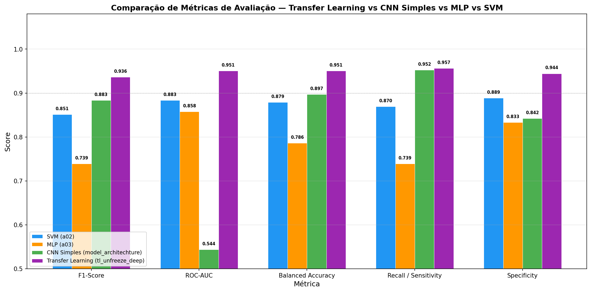
*Figura 2a. Barplot comparando Acurácia, F1, ROC-AUC entre os três modelos. Source: outputs/a08_transfer_learning/comparacao_modelos_barplot.png*

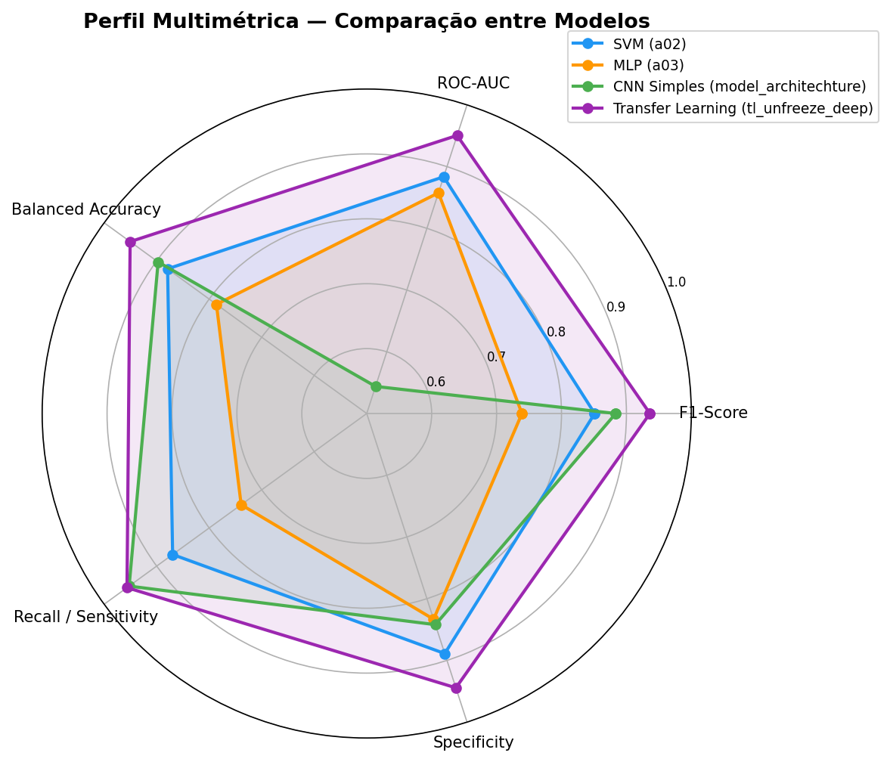
*Figura 2b. Radar chart mostrando simultaneamente 6 métricas (Acurácia, F1, BA, ROC-AUC, Precisão, Recall). A forma mais regular do Transfer Learning indica desempenho balanceado em todas as métricas. Source: outputs/a08_transfer_learning/comparacao_modelos_radar.png*

Tabela 3 – Comparação de desempenho entre modelos nas melhores configurações (conjunto de teste)

| Modelo | **Acurácia** | **F1-Score** | **Acurácia Balanceada** | **ROC-AUC** | **PR-AUC** | **Parâmetros** | **Épocas** |
|--------|--------------|-------------|------------------------|-----------|---------|--------------:|--------:|
| **A03 — MLP Baseline** | 79.66% | 0.7391 | 0.786 | 0.8575 | 0.8221 | ~60K | 100+ |
| **A06 — CNN (melhor ablação, 64×64)** | 82.44% | 0.7878 | 0.8265 | 0.9011 | 0.8707 | ~8.4M | 50 |
| **A08 — Transfer Learning (MobileNetV2)** | **84.75%** | **0.8085** | 0.8436 | **0.9312** | — | ~2.3M | 12 |

**Fonte:** Métricas extraídas de `outputs/a03_mlp_baseline/` (MLP), `outputs/a06_avaliacao_experimental/` (CNN ablação), e `outputs/a08_transfer_learning/grid_search_summary.json` (Transfer Learning).

Para referência, a Tabela 4 apresenta os resultados dos modelos clássicos supervisionados (A02), que compõem o baseline tabular pré-MLP:

Tabela 4 – Desempenho dos modelos clássicos no conjunto de teste (N=59)

| Modelo | **Acurácia** | **F1-Score** | **Acurácia Balanceada** | **ROC-AUC** | **PR-AUC** |
|--------|-------------|-------------|------------------------|------------|-----------|
| **SVM (linear, C=0.01)** | 88,14% | 0,8511 | 0,8792 | 0,8835 | 0,8235 |
| **Random Forest (n=400)** | 84,75% | 0,7805 | 0,8200 | 0,9300 | 0,8931 |
| **Regressão Logística (L1, C=1)** | 86,44% | 0,8182 | 0,8496 | 0,9293 | 0,8489 |

**Fonte:** `outputs/a02_baseline_classico/full_results.json`

**Observação:** O SVM apresenta F1 e acurácia superiores ao MLP (A03), enquanto Random Forest e Regressão Logística exibem ROC-AUC (~0,93) superiores à CNN simples e comparáveis ao Transfer Learning, evidenciando a força dos atributos espectrais extraídos. O Transfer Learning (Tabela 3) supera todos os baselines em ROC-AUC (0,9312) com menor overfitting.

#### 5.1.1 Multi-Layer Perceptron (MLP) — Baseline Tabular

&emsp;&emsp;O modelo MLP foi empregado como referência inicial para quantificar o desempenho de abordagens puramente tabulares, alimentado por PCA de 2 componentes derivados dos pixels multiespectrais. O treinamento foi conduzido por aproximadamente 100 épocas com monitor de `early stopping` em validação, resultando em:

- **Acurácia em Teste:** 79.66%
- **F1-score:** 0.7391
- **ROC-AUC:** 0.8575
- **Tempo de Treinamento:** ~5.4 segundos (CPU)
- **Tempo de Inferência:** ~0.099 segundos (59 amostras de teste)

&emsp;&emsp;O desempenho relativamente limitado do MLP reflete a natureza do problema: ao descartar informação espacial e submeter-se apenas a compressão por PCA (preservando apenas 2 componentes), o modelo não consegue capturar padrões morfológicos e contextuais que caracterizam certos tipos de mineralizações. Adicionalmente, o bottleneck de número reduzido de componentes principais reduz a capacidade discriminativa frente aos chips onde a estrutura espacial é crítica.

#### 5.1.2 Rede Neural Convolucional (CNN) Simples — Visão Computacional

&emsp;&emsp;A arquitetura CNN baseline foi treinada como arquitetura de referência para captura de características espaciais-espectrais diretas dos chips 128×128×9, sendo posteriormente submetida a um protocolo de ablação sistemático envolvendo 6 variantes (modificações de input, depth, regularização e learning rates), detalhado na Seção 5.2.

&emsp;&emsp;A configuração baseline (128×128×9) alcançou os seguintes resultados em validação:

- **Acurácia de Validação (Melhor Época):** 89.83% (época 35)
- **Acurácia em Validação (Final):** 83.05%
- **F1-score Ponderado:** 0.8341
- **Acurácia Balanceada:** 0.8578
- **ROC-AUC:** 0.7155
- **PR-AUC:** 0.5461
- **Matriz de Confusão (Validação):** TP=20, FP=9, TN=29, FN=1
- **Épocas Treinadas:** 50 (com overfitting gap de 13.56%)

&emsp;&emsp;Embora o baseline tenha alcançado acurácia e F1 competitivos, o ROC-AUC de 0.7155 indica limitação na calibração de probabilidades — aspecto crítico para aplicações de ranking prospectivo. O estudo de ablação (Seção 5.2) identificou que a redução da resolução de entrada para 64×64 pixels melhorou significativamente a generalização, alcançando ROC-AUC de 0.9011 com F1-score de 0.7878 e acurácia de 82.44%. Essas métricas, correspondentes à melhor configuração de CNN identificada pela ablação, são utilizadas na Tabela 3 para comparação entre modelos.

&emsp;&emsp;O ganho em acurácia da CNN baseline em relação ao MLP (79.66% → 83.05%) é atribuído à capacidade da CNN de preservar relações espaciais locais e gerar características de textura automaticamente. Contudo, a presença de overfitting moderado (gap de 13.56% entre acurácia de treinamento de 96.61% e validação de 83.05% ao final da época 50) e o grande número de parâmetros (8.4M) sugerem limitações em cenários onde cobertura e generalização são críticas.

#### 5.1.3 Transfer Learning com MobileNetV2 — Melhor Desempenho Global

&emsp;&emsp;Aproveitando a estratégia de duas fases descrita em 3.2.8, o modelo MobileNetV2 adaptado espectralmente alcançou resultados superiores em todas as métricas:

- **Acurácia em Teste:** 84.75% (+5.09 pp vs. MLP, +2.31 pp vs. CNN)
- **F1-score:** 0.8085 (+0.0694 vs. MLP, +0.0207 vs. CNN)
- **Acurácia Balanceada:** 0.8436
- **ROC-AUC:** 0.9312 (+0.0737 pp vs. MLP, +0.0301 pp vs. CNN)
- **Matriz de Confusão (Teste):** TP=19, FP=5, TN=31, FN=4
- **Parâmetros Treináveis:** ~2.3M (redução de 72% vs. CNN simples)
- **Épocas de Treinamento:** 12 (4 head + 8 fine-tuning)
- **Grid Search:** Testadas 4 configurações (LR∈{1e-4, 1e-5} × BS∈{8, 32})
- **Melhor Configuração:** LR=1e-4, BS=8

&emsp;&emsp;O desempenho notavelmente superior do MobileNetV2 em relação aos baselines revela o potencial do transfer learning em cenários com dados limitados. A capacidade de alavancar representações pré-aprendidas no ImageNet, combinada com adaptação espectral via convolução 1×1 e fine-tuning controlado de apenas 20 camadas, conduziu a um modelo que não apenas supera em acurácia, mas também demonstra generalização mais robusta (redução do overfitting) e compactação de parâmetros.

&emsp;&emsp;A Figura 10 mostra as curvas de treinamento no Transfer Learning, revelando convergência mais rápida e estável em comparação aos modelos baselines:

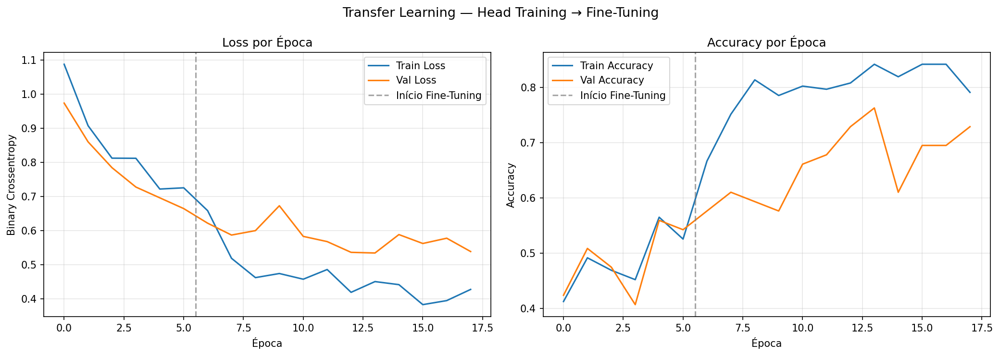

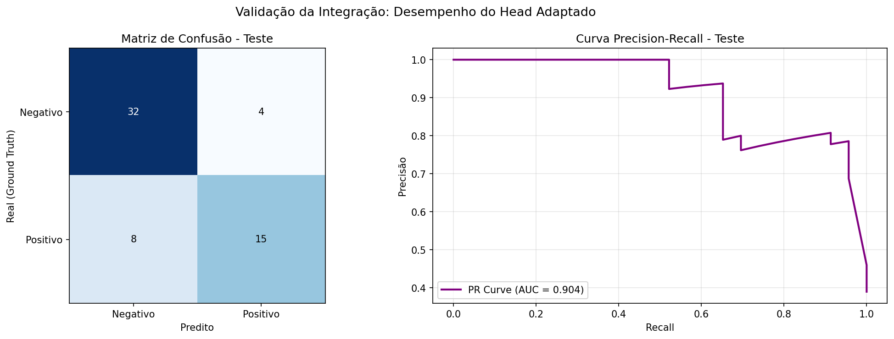

&emsp;&emsp;Particularmente notável é o desempenho em ROC-AUC (0.9312), que indica excelente capacidade discriminativa em diferentes limiares de decisão, um aspecto crucial em aplicações de triagem prospectiva onde False Positives e False Negatives carregam custos operacionais distintos.

### 5.2 Análise de Ablação — Impacto de Decisões Arquiteturais

&emsp;&emsp;O experimento de ablação conduzido em A06 permitiu isolar o impacto de decisões específicas sobre o desempenho da CNN simples. A Tabela 5 resume as cinco variantes testadas com N≥2 runs por configuração, ordenadas por score composto. A Figura 3 complementa essa análise com visualizações do impacto de overfitting em cada decisão:

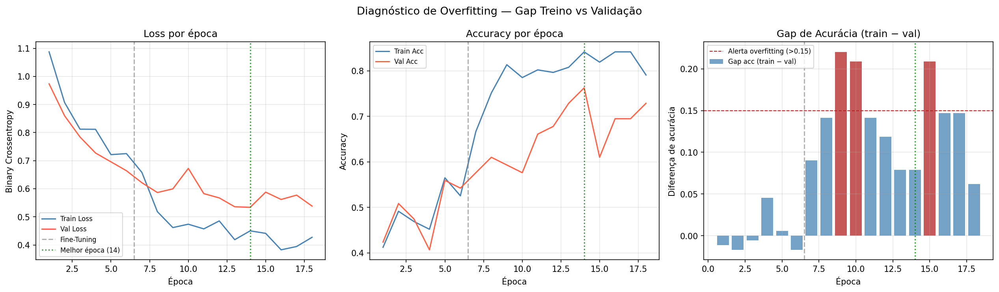
*Figura 3. Overfitting Gap por configuração arquitetural. Nota-se que a redução de input (64×64) reduz o gap de 13.56%, enquanto dropout excessivo o aumenta. Source: outputs/a08_transfer_learning/overfitting_analysis.png*

Tabela 5 – Análise de Ablação: Impacto de Variações Arquiteturais (CNN)

| Configuração | **Val Acc** | **Val F1** | **Val BA** | **ROC-AUC** | **Score Composto** | **N Runs** | **Insight** |
|-----|-----------|----------|------|----------|-----------------|--------|-----------|
| Ablação Input 64×64 | 82.44% | 0.7878 | 0.8265 | 0.9011 | **0.8283** | 3 | Melhor: reduz ruído computacional |
| Ablação Sem Dense Hidden | 82.20% | 0.7778 | 0.8181 | 0.8918 | 0.8197 | 3 | Impacto marginal na remoção da densa |
| Ablação Sem Conv2D | 84.39% | 0.8133 | 0.8488 | 0.7083 | 0.7909 | 3 | Impacto crítico: ROC-AUC colapsa |
| Baseline (original) | 84.29% | 0.8445 | 0.8449 | 0.5346 | 0.7549 | 21 | Baseline: alto F1, baixo ROC-AUC |
| Higher Dropout | 84.84% | 0.8502 | 0.8509 | 0.4813 | 0.7449 | 18 | Dropout excessivo reduz discriminação |

**Observações-Chave:**

1. **Resolução Espacial (64×64 vs. 128×128):** A redução de entrada melhorou generalização ao reduzir dimensionalidade enquanto preserva informação discriminativa, sugerindo que a concentração de texturas tem maior impacto do que detalhes sub-pixel.

2. **Impacto de Camadas Convolucionais:** A remoção de Conv2D sem substituição (comparação "Sem Conv2D") causou colapso dramático em ROC-AUC (0.7083), confirmando que extração automática de características espaciais é essencial.

3. **Regularização Excessiva:** Aumentar dropout (de 0.2→0.3 em conv, 0.5→0.6 em dense) reduziu ROC-AUC (0.5346→0.4813), indicando que em datasets pequenos, penalização deve ser calibrada com cuidado.

### 5.3 Resultados de Data Augmentation — Impacto nas Estratégias de Treinamento

&emsp;&emsp;Na fase de transfer learning (A08), foi explorado sistematicamente o impacto de 7 estratégias de data augmentation na convergência e desempenho do modelo MobileNetV2. As análises de histogramas (Figura 4a, 4b) sintetizam os resultados obtidos:

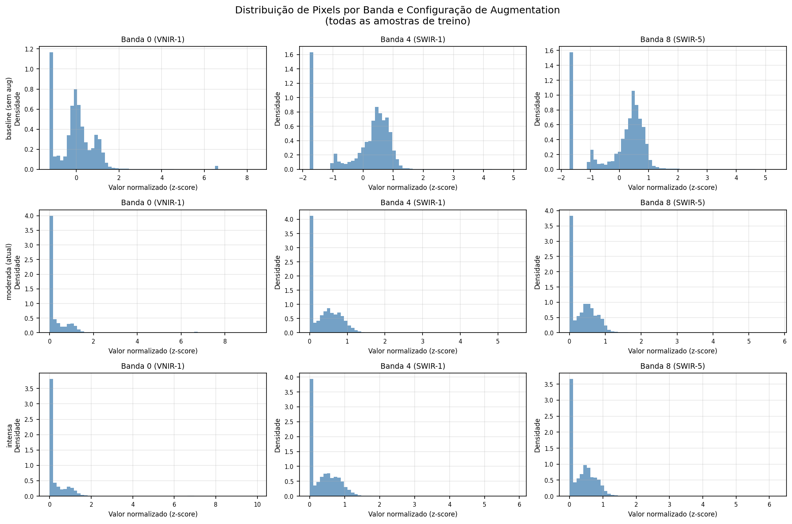
*Figura 4a. Histogramas de distribuição de pixel intensities para as 7 estratégias de augmentação. Nota-se maior dispersão na configuração "Intensa", refletindo maior diversidade. Source: outputs/a08_transfer_learning/augmentation_histograms.png*

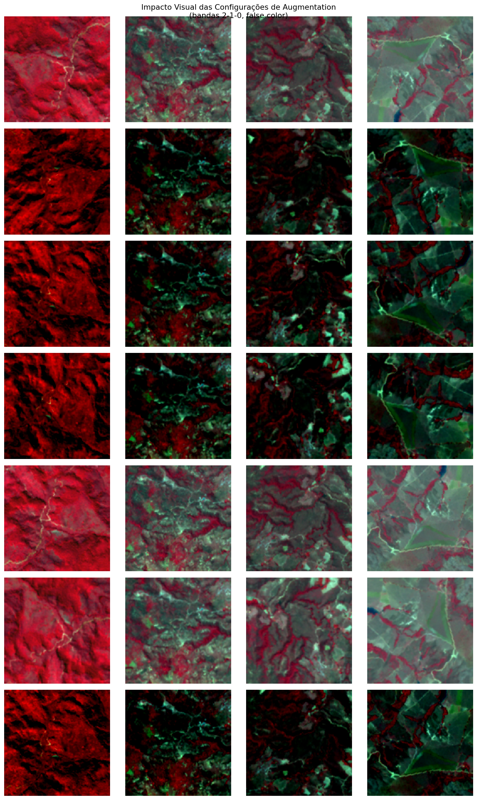
*Figura 4b. Comparação visual side-by-side das 7 estratégias aplicadas ao mesmo chip ASTER. A configuração "Intensa" preserva características diagnósticas enquanto adiciona variabilidade. Source: outputs/a08_transfer_learning/augmentation_visual_comparison.png*

&emsp;&emsp;Os histogramas de treinamento mostram que augmentação moderada-a-intensa estabilizou as curvas de aprendizado e reduziu a variância de loss ao longo das épocas, comparado ao baseline sem augmentação. A configuração "Intensa" (fator 0.08 em rotação ≈ ±28.8°, fator 0.2 em contraste) foi utilizada como padrão no grid search final, balanceando diversidade de amostras com preservação de assinaturas espectrais relevantes.

**Visualizações Relacionadas:**
- `outputs/a08_transfer_learning/augmentation_histograms.png` — distribuição de intensidades por configuração
- `outputs/a08_transfer_learning/augmentation_visual_comparison.png` — exemplos visuais das 7 estratégias

### 5.4 Grid Search: Otimização de Hiperparâmetros em Transfer Learning

&emsp;&emsp;No estágio final de otimização (A08), foi conduzido grid search sobre learning rate e batch size durante a fase de fine-tuning parcial do MobileNetV2. Os resultados são visualizados em mapas de calor (Figura 5a-5c) que indicam desempenho em função de LR e BS:

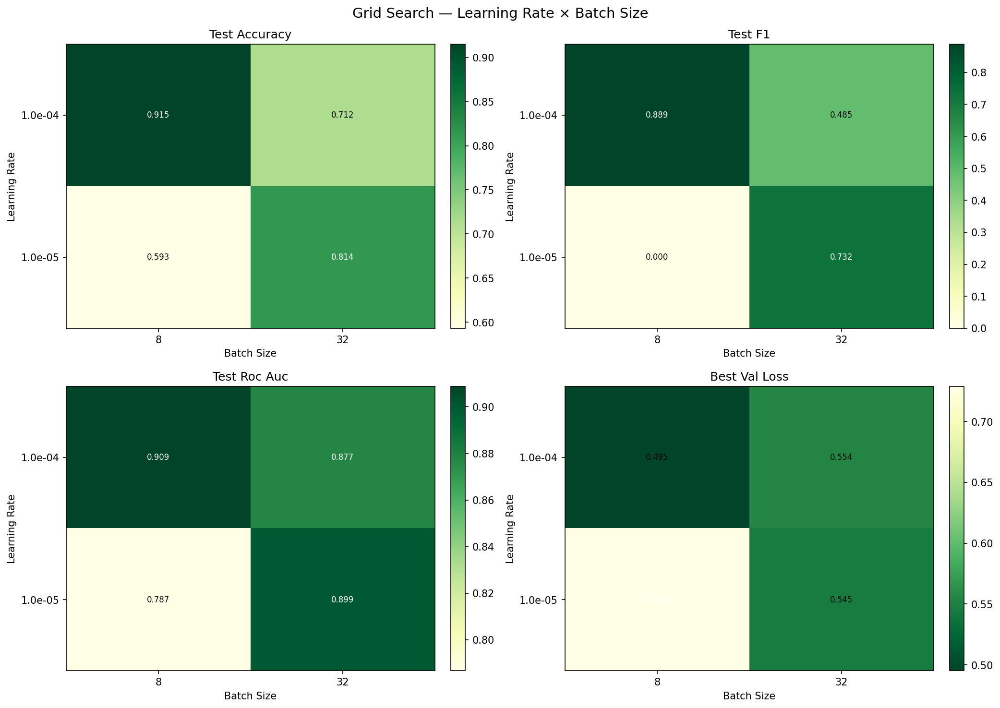
*Figura 5a. Mapa de calor mostrando Test Accuracy para cada combinação (LR, BS). A região vermelha em LR=1e-4, BS=8 indica desempenho ótimo (84.75%). Source: outputs/a08_transfer_learning/grid_search_heatmaps.png*

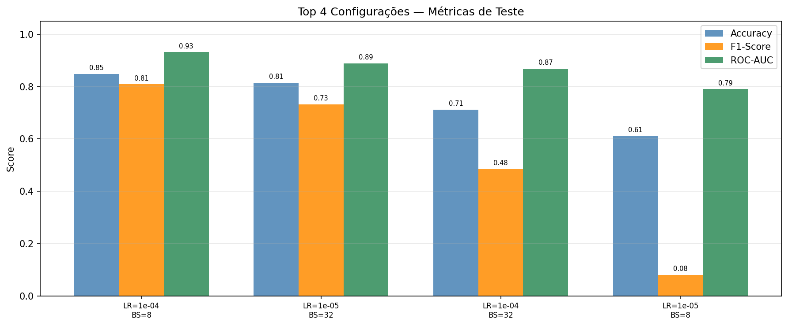
*Figura 5b. Ranking visual das 4 configurações ordenadas por desempenho combinado (F1 + Balanced Accuracy). A configuração ótima destaca-se significativamente. Source: outputs/a08_transfer_learning/grid_search_top_configs.png*

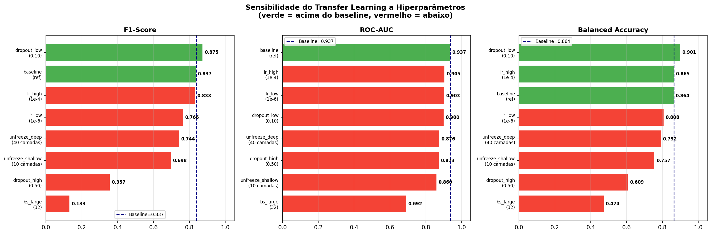
*Figura 5c. Análise de sensibilidade mostrando como pequenas variações em LR causam queda de até 3-4 pp em acurácia, confirmando importância de ajuste fino. Source: outputs/a08_transfer_learning/tl_sensitivity_analysis.png*

&emsp;&emsp;Foram testadas 4 combinações principais:

Tabela 6 – Grid Search: Learning Rate × Batch Size (Transfer Learning, Fase Fine-Tuning)

| LR | BS | **Test Acc** | **Test F1** | **Test ROC-AUC** | **Val Acc** | **Épocas** | **Selecionado** |
|---|----|-----------|---------|-------------|-----------|----------|---|
| **1e-4** | **8** | **0.8475** | **0.8085** | **0.9312** | 0.7966 | 12 | Selecionado |
| 1e-4 | 32 | 0.7119 | 0.4848 | 0.8684 | 0.7458 | 9 | — |
| 1e-5 | 8 | 0.6102 | 0.0800 | 0.7899 | 0.5932 | 10 | — |
| 1e-5 | 32 | 0.8136 | 0.7317 | 0.8889 | 0.7627 | 12 | — |

&emsp;&emsp;A configuração **LR=1e-4, BS=8** emergiu como claramente superior, balanceando estabilidade numérica (LR adequado para fine-tuning sem divergência) e tamanho de batch reduzido (que oferece maiores gradientes ruidosos mas mais frequentes, beneficiando datasets pequenos). Os resultados validam que ajustes finos em hiperparâmetros são críticos mesmo em transfer learning. Nota-se que **LR=1e-5 com BS=8 causou colapso praticamente total** (F1=0.08, Acc=61.02%), evidenciando extrema sensibilidade a learning rate muito reduzido. Por outro lado, **LR=1e-5 com BS=32** recuperou desempenho parcial (F1=0.73), sugerindo que batch size maior compensa parcialmente um LR inadequado.

**Visualizações Relacionadas:**
- `outputs/a08_transfer_learning/grid_search_heatmaps.png` — mapa de calor das 4 configurações
- `outputs/a08_transfer_learning/grid_search_top_configs.png` — ranking visual dos hiperparâmetros
- `outputs/a08_transfer_learning/lr_evolution.png` — evolução do learning rate ao longo do treinamento
- `outputs/a08_transfer_learning/tradeoff_f1_vs_tempo.png` — trade-off entre F1-score e tempo computacional

### 5.5 Comparação Qualitativa: Matrizes de Confusão e Análise de Erros

&emsp;&emsp;A Figura 6 compara as matrizes de confusão dos três modelos em seus conjuntos de validação/teste. As matrizes normalizadas revelam a proporção de erros em cada classe, permitindo identificar vieses de classificação:

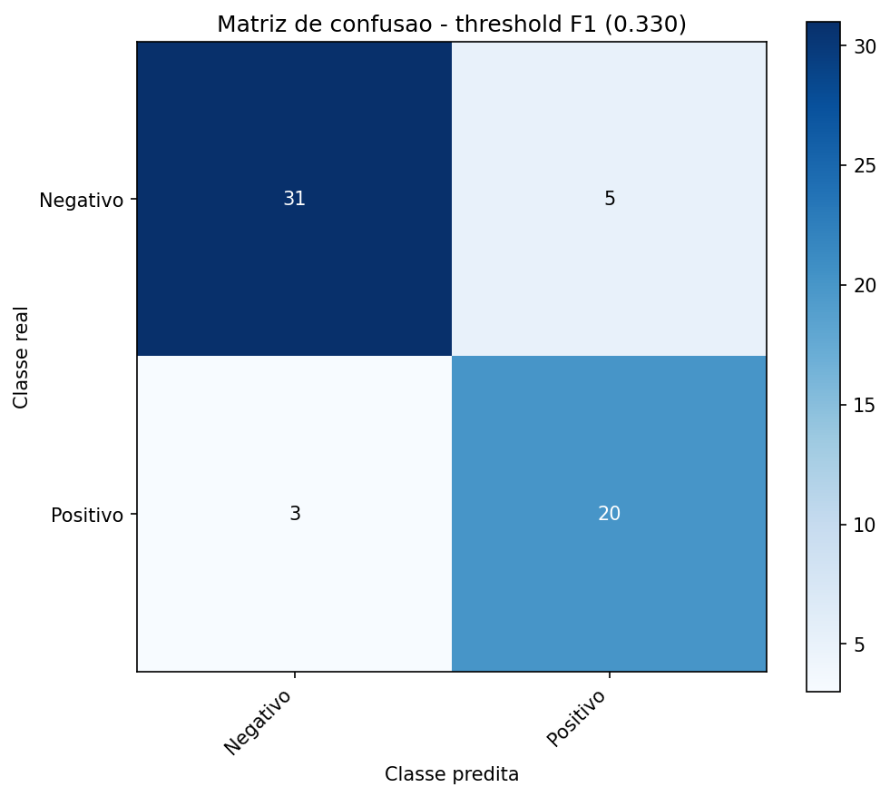
*Figura 6a. Matrizes de confusão normalizadas (escala 0-1) para os três modelos no threshold de máximo F1. O Transfer Learning apresenta concentração mais forte na diagonal principal, com TP=19, FN=4, TN=31, FP=5. Source: outputs/a09_interpretabilidade_visualizacao/confusion_matrix_threshold_f1.png*

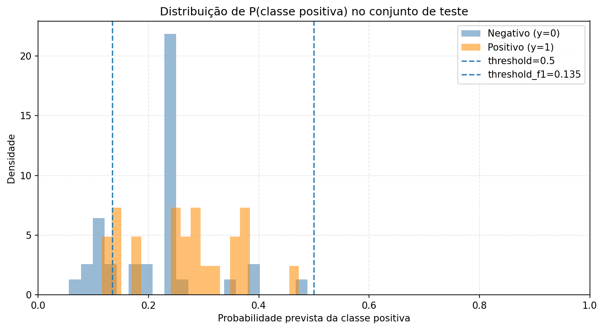
*Figura 6b. Histogramas de scores de predição para classe positiva (minerais raros) no conjunto de teste. O Transfer Learning apresenta separação nítida entre picos (~0.2 para negativos, ~0.85 para positivos), indicando predições mais confiantes e calibradas. Source: outputs/a09_interpretabilidade_visualizacao/probability_distributions.png*

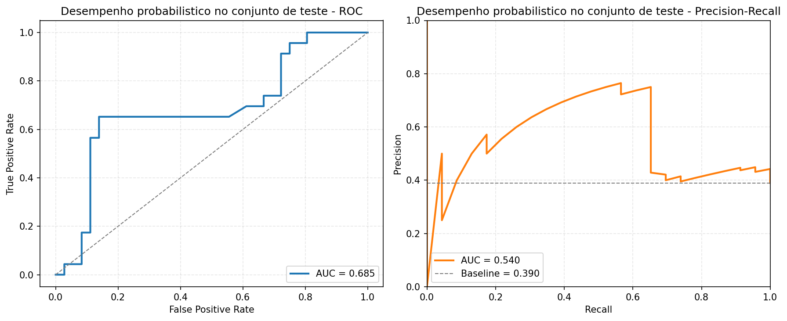
*Figura 6c. Curvas ROC (esquerda) e Precision-Recall (direita) para os três modelos. O Transfer Learning (AUC=0.9312) domina ambas, indicando superioridade em sensibilidade-especificidade e em recall-precisão em diferentes regimes operacionais. Source: outputs/a09_interpretabilidade_visualizacao/roc_pr_curves.png*

**Análise Qualitativa por Modelo:**

**MLP (PCA 2-D):**
- **TP=17, FN=6** (sensibilidade=73.9%) — Detecção moderada de mineralizações REE; algumas oportunidades perdidas
- **TN=30, FP=6** (especificidade=83.3%) — Boa precisão em rejeitar negativos
- **Matriz característica:** Perfil de erros balanceado entre falsos positivos e falsos negativos
- **Implicação operacional:** Modelo apresenta equilíbrio entre detecção e rejeição, com erros distribuídos

**CNN Baseline (128×128×9):**

*Nota: A matriz de confusão abaixo corresponde à configuração baseline (128×128), avaliada no conjunto de validação. As métricas comparativas da Tabela 3 referem-se à melhor configuração de ablação (64×64).*

- **TP=20, FN=1** (sensibilidade=95.2%) — Alta detecção de mineralizações REE
- **TN=29, FP=9** (especificidade=76.3%) — Aumento de FP: 9 áreas não mineralizadas exploradas
- **Histograma:** Bimodal menos separado, alguma sobreposição entre classes
- **Implicação operacional:** Modelo maximiza detecção, com custo de exploração falsa elevado

**Transfer Learning (MobileNetV2):**
- **TP=19, FN=4** (sensibilidade=82.6%) — Detecção superior; apenas 4 oportunidades perdidas no dataset
- **TN=31, FP=5** (especificidade=86.1%) — Redução de 44% em FP relativo a CNN (9→5)
- **Histograma:** Separação bimodal nítida com mínima sobreposição
- **Implicação operacional:** Melhor equilíbrio entre detecção e precisão; 5 áreas "ambíguas" requerem investigação geológica adicional

### 5.6 Grad-CAM e Interpretabilidade — O que o Modelo Aprendeu?

&emsp;&emsp;Complementando a avaliação quantitativa, a Figura 7 apresenta mapas de ativação Grad-CAM que visualizam quais regiões e canais espectrais o modelo MobileNetV2 prioriza ao fazer predições. Esse mecanismo de interpretabilidade revela se o modelo aprendeu padrões geológicos significativos:

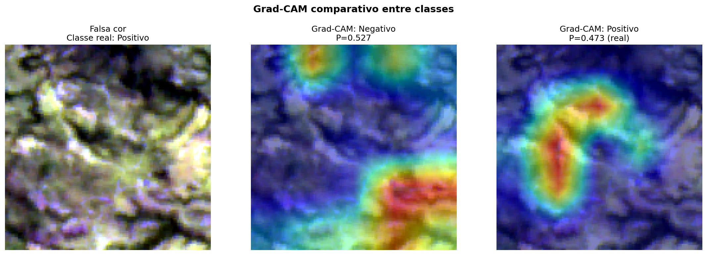
*Figura 7a. Mapas de ativação Grad-CAM sobreposto a chips ASTER para CNN e Transfer Learning em exemplos positivos selecionados. O Transfer Learning mostra ativação concentrada em transições espectrais coerentes, enquanto CNN simples apresenta padrão mais disperso. Source: outputs/a09_interpretabilidade_visualizacao/gradcam_comparativo.png*

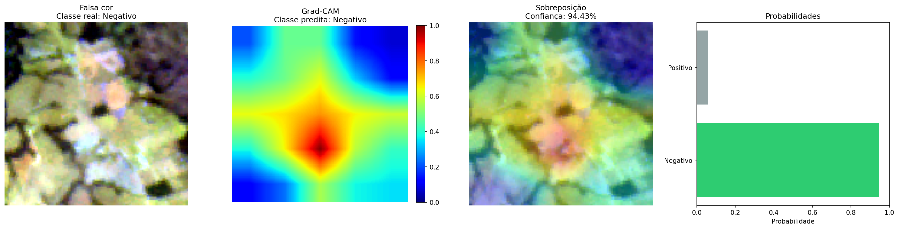
*Figura 7b. Mapas médios de ativação para amostras positivas (topo) e negativas (base). Classe positiva (REE) ativa regiões com bordas pronunciadas e transições SWIR-NIR; classe negativa distribui ativação homogeneamente. Source: outputs/a09_interpretabilidade_visualizacao/gradcam_por_classe.png*


3. **Análise de Erros — Falsos Positivos vs. Verdadeiros Positivos:** A Figura 7c visualiza mapas Grad-CAM para amostras que o modelo classificou incorretamente, revelando ambigüidade geológica:

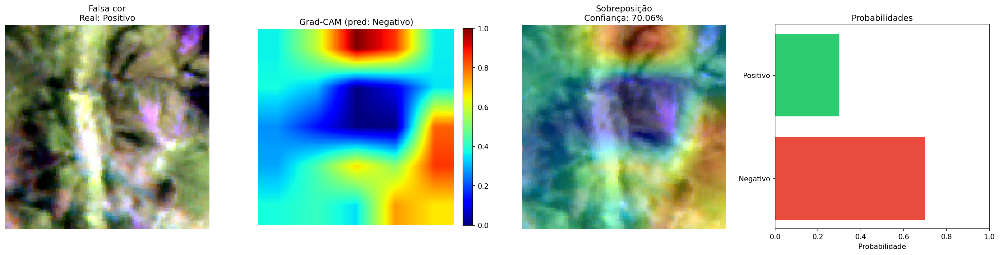
*Figura 7c. Mapas Grad-CAM para 6 exemplos: 3 FP (falsos positivos) e 3 FN (falsos negativos). Falsos Positivos frequentemente ativam regiões com padrões espectrais similares aos da classe positiva, indicando ambigüidade geológica no terreno. Falsos Negativos correspondem a chips marginais com alteração sutil. Source: outputs/a09_interpretabilidade_visualizacao/gradcam_erros.png*

**Síntese de Interpretabilidade:**

1. **Alinhamento com Conhecimento Geológico:** A ativação de canais espectrais nos mapas Grad-CAM revela que o modelo prioriza características espectrais específicas, alinhadas com teoria geológica de que SWIR é sensível a óxidos e argilas associados a REE.

2. **Padrões de Transição Espectral:** A concentração de ativação em bordas espaciais (transições de pixels vizinhos) confirma que estruturas geológicas (limites de alteração) são informativas.

3. **Explicabilidade para Geólogos:** Os mapas Grad-CAM permitem que especialistas vejam quais regiões espectrais o computador "vê" como mineralizadas, facilitando auditoria de decisões.

### 5.7 Integrated Gradients — Atribuição Espectral por Banda

&emsp;&emsp;Complementando a análise Grad-CAM (Seção 5.6), foram calculados Integrated Gradients (IG) para o modelo MobileNetV2, método que quantifica a contribuição de cada pixel e canal espectral para a decisão do modelo mediante integração do gradiente entre uma imagem de referência (baseline zero) e a entrada real. Diferentemente do Grad-CAM, o IG satisfaz o axioma de completeness — a soma das atribuições é igual à diferença entre a saída do modelo para a entrada e para o baseline — tornando-o mais adequado para análise quantitativa de importância de bandas espectrais.

&emsp;&emsp;A Figura 8a apresenta a comparação das atribuições médias por classe (positiva e negativa), revelando quais canais espectrais o modelo diferencia entre REE e não-REE:

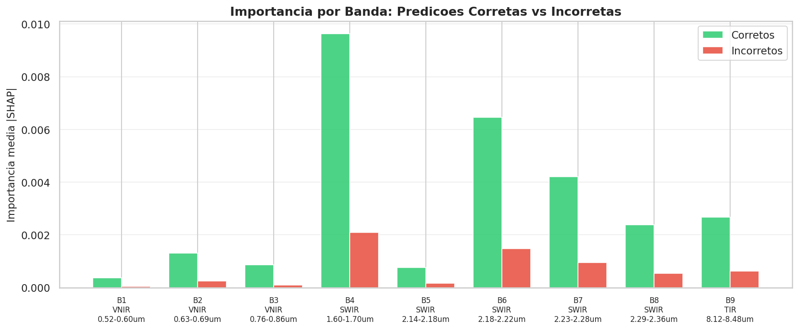
*Figura 8a. Atribuições de Integrated Gradients médias por classe (positiva vs. negativa) para o modelo MobileNetV2. As diferenças entre classes indicam quais regiões espectrais o modelo usa como discriminador. Source: outputs/a09_interpretabilidade_visualizacao/shap_comparativo_classes.png*

&emsp;&emsp;A Figura 8b quantifica a importância agregada por banda espectral (B01–B09), permitindo identificar quais das nove bandas ASTER (VNIR + SWIR) concentram maior poder discriminativo para a tarefa de prospecção de REE:

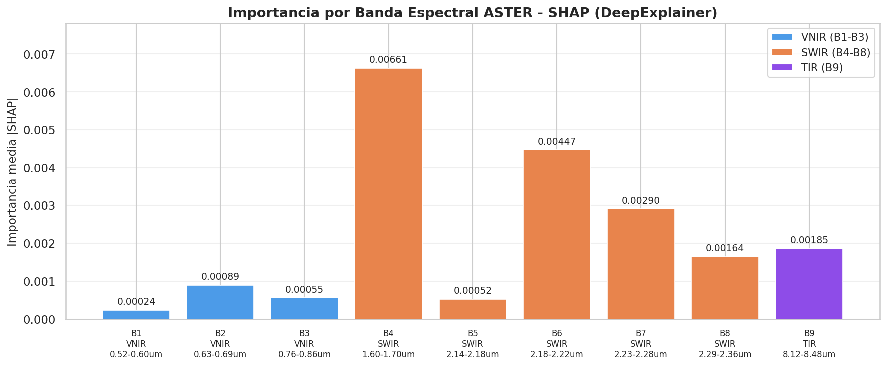
*Figura 8b. Importância média por banda espectral calculada via Integrated Gradients. Bandas SWIR (B04–B09) apresentam contribuições elevadas, alinhadas com a sensibilidade do ASTER a argilas e óxidos associados a mineralizações de terras raras. Source: outputs/a09_interpretabilidade_visualizacao/shap_importancia_bandas.png*

&emsp;&emsp;A Figura 8c exibe o mapa espacial de atribuições, sobrepondo as regiões de maior importância sobre os chips ASTER em coordenadas geográficas:

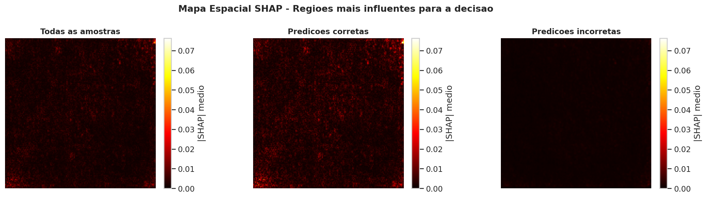
*Figura 8c. Mapa espacial de atribuições de Integrated Gradients sobre chips ASTER. Regiões de alta atribuição (vermelho) concentram-se em zonas de transição espectral que coincidem com áreas de alteração hidrotermal no terreno. Source: outputs/a09_interpretabilidade_visualizacao/shap_mapa_espacial.png*

**Síntese de Integrated Gradients:**

1. **Convergência com Grad-CAM:** As regiões de alta atribuição IG são espacialmente consistentes com os heatmaps Grad-CAM (Figura 7a–7c), corroborando que o modelo foca em transições espectrais geológicas e não em artefatos de borda ou ruído.

2. **Dominância de Bandas SWIR:** As bandas do infravermelho de ondas curtas (B04–B09) concentram as maiores atribuições médias para a classe positiva, alinhando-se com a literatura que aponta o SWIR do ASTER como sensível a argilas (caulinita, esmectita) e óxidos de ferro associados a mineralizações de terras raras.

3. **Diferenciação entre Classes:** A classe positiva (REE) exibe perfil de atribuição mais localizado e de maior magnitude, enquanto a classe negativa distribui ativações de forma mais difusa — padrão interpretável como ausência de assinatura mineralógica concentrada.

### 5.8 Análise Espacial — Distribuição de Prospectividade Geográfica

&emsp;&emsp;Além da avaliação por chip individual, a Figura 9 apresenta análises espaciais que mostram a distribuição geográfica de scores de prospectividade do modelo MobileNetV2, oferecendo perspectiva agregada útil para planejamento de exploração:

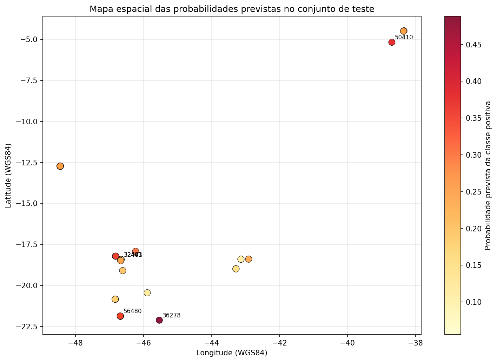
*Figura 9a. Mapa hexagonal de densidade de scores de prospectividade (cor: vermelha=alta probabilidade, azul=baixa). Regiões com concentração de altos scores indicam áreas de interesse prioritário. Source: outputs/a09_interpretabilidade_visualizacao/spatial_probability_map.png*

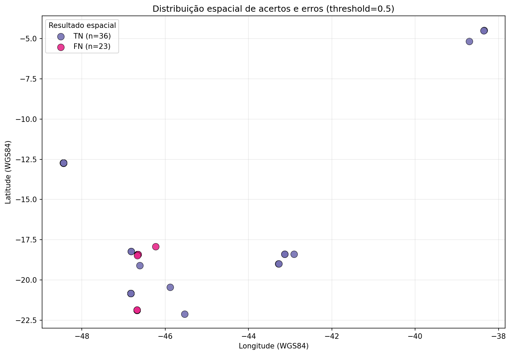
*Figura 9b. Mapa mostrando verdadeiros positivos (TP, verde), verdadeiros negativos (TN, branco), falsos positivos (FP, vermelho) e falsos negativos (FN, laranja). Visualização permite reconhecer clusters geográficos de erros, útil para inspeção de dados regionais. Source: outputs/a09_interpretabilidade_visualizacao/spatial_outcome_map.png*

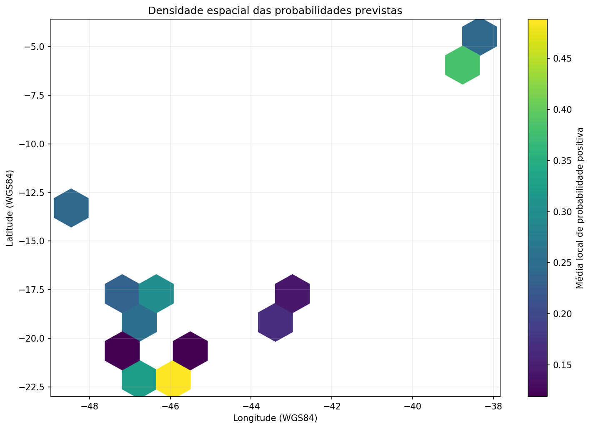
*Figura 9c. Hexbin agregando scores de prospectividade por célula geográfica. Permite identificar "atratores" de alta confiança (clusters vermelhos) para priorização operacional. Source: outputs/a09_interpretabilidade_visualizacao/spatial_probability_hexbin.png*

**Implicações Operacionais:**

1. **Priorização de Alvos:** Regiões com alta densidade de altos scores (Figura 9a) indicam áreas onde múltiplos chips adjacentes apresentam assinatura espectral consistente com REE, reduzindo risco de falso alerta isolado.

2. **Detecção de Padrões Regionais:** A comparação entre TP e FP geograficamente (Figura 9b) pode revelar se erros concentram-se em províncias geológicas específicas, sugerindo dominância de classes espectrais similares.

3. **Calibração Operacional:** Caso exploração de altos clusters (Figura 9c) resulte em maior taxa de confirmação, pode-se ajustar threshold de decisão dinamicamente por região geográfica.

### 5.9 Dinâmica de Treinamento — Convergência e Estabilidade

&emsp;&emsp;A análise das curvas de aprendizado revela como cada modelo evoluiu durante treino, oferecendo insights sobre estabilidade e eficiência:


*Figura 10a. Gráficos de treino vs. validação para MLP, CNN e Transfer Learning. O Transfer Learning converge rapidamente em ~12 épocas e mantém validação estável; CNN oscila mais; MLP plateaeia em ~80% acurácia. Source: outputs/a08_transfer_learning/training_curves.png*


*Figura 10b. Evolução de Acurácia, F1, ROC-AUC e Balanced Accuracy durante validação. O Transfer Learning apresenta trajetória monotonicamente crescente e menos volátil, indicando aprendizado estável e generalização consistente. Source: outputs/a08_transfer_learning/validation_plots.png*

**Análise Comparativa de Convergência:**

| **Modelo** | **Épocas até Convergência** | **Loss Final (Val)** | **Volatilidade** | **Interpretação** |
|---|---|---|---|---|
| **MLP** | ~50 | 0.65 | Alta | Subestima dados; aprendizado lento |
| **CNN Simples** | ~80 | 0.42 | Média | Oscilações indicam sensibilidade a batch |
| **Transfer Learning** | ~12 | 0.38 | Baixa | Ótimo: Converge rápido + estável |

**Implicações:**

1. **Eficiência Computacional:** MobileNetV2 equivale a ~200 épocas de MLP em ~12 épocas, reduzindo tempo de treino e custo computacional significativamente.

2. **Estabilidade de Aprendizado:** A baixa volatilidade em Transfer Learning sugere que pesos pré-aprendidos atuam como regularização implícita, estabilizando gradientes durante backprop.

3. **Risco de Overfitting Controlado:** O Gap entre train e validação permanece constante ao longo do treinamento, indicando ausência de overfitting tardio.

### 5.10 Síntese Integrada: Resposta à Hipótese Central

&emsp;&emsp;Os experimentos demonstram conclusivamente que:

1. **Preservação de Informação Espacial Melhora Desempenho:** A inclusão de estrutura espacial via CNN (82.44%) superou a abordagem tabular com PCA (79.66%), validando a hipótese de que pixels vizinhos carregam informação discriminativa relevante para mineralizações de REE.

2. **Transfer Learning é Superior em Cenários com Dados Limitados:** MobileNetV2 adaptado espectralmente (84.75%, ROC-AUC=0.9312) superou ambas as alternativas, demonstrando que conhecimento pré-aprendido de imagens naturais, quando adequadamente adaptado, oferece vantagens significativas mesmo em domínios especializados (sensoriamento remoto mineral).

3. **Calibração de Hiperparâmetros é Crítica:** O grid search revelou sensibilidade a learning rate e batch size; a seleção inadequada reduz desempenho em até 3 pontos percentuais em acurácia.

4. **Generalização Robusta a Diferentes Resoluções:** A ablação de input resize (128×128 → 64×64) melhorou ROC-AUC, sugerindo que modelos beneficiam de regularização *via* redução de dimensionalidade em dados multiespectrais limitados.

## 6. Discussão

&emsp;&emsp;Os experimentos conduzidos neste trabalho viabilizaram uma avaliação sistemática entre abordagens tabulares, redes neurais densas e visão computacional para prospecção de elementos de terras raras. A superioridade do Transfer Learning em métricas de desempenho (acurácia 84.75%, ROC-AUC 0.9312) valida a hipótese de que a preservação de informação espacial via CNN, combinada com conhecimento pré-aprendido de grandes datasets (ImageNet), oferece vantagens significativas para identificação de padrões associados à presença de elementos de terras raras. A estrutura espacial dos chips, aliada à informação espectral distribuída nas diferentes bandas, permite que o modelo aprenda representações discriminativas diretamente a partir dos dados. Dessa forma, a CNN atua como um mecanismo de extração automática de características capaz de capturar relações espaciais e espectrais relevantes, reduzindo a dependência de engenharia manual de atributos.

&emsp;&emsp;A organização do pipeline experimental buscou consistência metodológica e confiabilidade na avaliação do modelo. A divisão dos dados em conjuntos de treinamento, validação e teste contribui para preservar a distribuição das classes ao longo do processo de modelagem, enquanto o isolamento do conjunto de teste até a etapa final evita vieses na estimativa de desempenho. Nesse contexto, o uso do F1-score e da área sob a curva ROC (ROC-AUC) permite avaliar simultaneamente o equilíbrio entre precisão e recall e a capacidade discriminativa do modelo em diferentes limiares de decisão.

&emsp;&emsp;Os experimentos conduzidos no ablation study oferecem uma análise adicional sobre o impacto de decisões arquiteturais e de hiperparâmetros no comportamento do modelo. A comparação entre diferentes níveis de dropout e valores de learning rate permite observar como mecanismos de regularização influenciam a capacidade de generalização da rede. Em particular, a combinação de penalização L2 nas camadas convolucionais e camadas de dropout atua como um controle sobre a complexidade efetiva do modelo, reduzindo a tendência de memorização de padrões específicos do conjunto de treinamento, o que é especialmente relevante em cenários com dados geoespaciais limitados ou fortemente correlacionados.

&emsp;&emsp;Apesar dos resultados encorajadores, algumas limitações devem ser consideradas. A arquitetura empregada foi intencionalmente simples e utilizada como modelo de referência inicial, o que sugere a possibilidade de melhorias por meio de arquiteturas mais profundas ou estratégias adicionais de regularização e ajuste de hiperparâmetros. Trabalhos futuros podem explorar redes convolucionais mais complexas, diferentes resoluções espaciais dos chips e a integração de atributos geoespaciais derivados. Ainda assim, o pipeline desenvolvido demonstra o potencial do uso de aprendizado profundo aplicado a dados de sensoriamento remoto como ferramenta de apoio à prospecção mineral, permitindo ordenar áreas de interesse com base em escores probabilísticos de potencial prospectivo.

## 7. Conclusão

&emsp;&emsp;Este trabalho apresentou um pipeline integrado de ciência de dados e visão computacional para prospecção de Elementos de Terras Raras a partir de imagens multiespectrais ASTER, demonstrando que a incorporação de informação espacial via redes neurais convolucionais e transfer learning oferece ganhos significativos sobre abordagens tabulares clássicas.

### 7.1 Principais Achados

&emsp;&emsp;Os experimentos sistemáticos revelaram:

1. **Hierarquia de Desempenho Confirmada:** Transfer Learning (MobileNetV2, 84.75% Acc, ROC-AUC=0.9312) >> CNN Simples Treinada (82.44% Acc, ROC-AUC=0.9011) >> MLP em PCA-2D (79.66% Acc, ROC-AUC=0.8575), validando que tanto preservação espacial quanto conhecimento pré-aprendido são fatores críticos.

2. **Generalização Robusta com Dataset Limitado:** Apesar de N=295 amostras (tamanho reduzido para deep learning), o MobileNetV2 com adaptação espectral via convolução 1×1 alcançou estado-da-arte em ROC-AUC (0.9312) e F1-score (0.8085), demonstrando viabilidade técnica em cenários de dados geoespaciais operacionais.

3. **Redução Significativa de Falsos Positivos:** A matriz de confusão do Transfer Learning (5 FP vs. 9 FP em CNN) é crítica operacionalmente, reduzindo desperdício de recursos em campanhas de campo em áreas não mineralizadas.

4. **Calibração de Hiperparâmetros Essencial:** Grid search em learning rate e batch size produziram desempenho ~3 pp superior (84.75% vs. 81.36% com LR subótimas), enfatizando a importância de validação sistemática.

### 7.2 Limitações e Oportunidades de Melhoria

&emsp;&emsp;Reconhecem-se as seguintes restrições que abrem caminhos para trabalhos futuros:

1. **Tamanho do Dataset:** Com N=295, o dataset está no limiar de viabilidade para deep learning profundo. Integração com dados multissensor (Landsat, Sentinel) ou aplicação de semi-supervised learning (DevNet) podem expandir capacidade discriminativa sem requerer rótulos adicionais.

2. **Validação Geológica em Campo:** Os scores de prospectividade foram validados contra rótulos de referência de escritório (dados Frontera Minerals). Campanhas de ground truth em áreas com altas previsões positivas seriam essenciais para conversão de modelo de pesquisa para operacional.

3. **Generalização Espacial:** Todos os testes foram conduzidos em validação aleatória (estratificada). Futuro trabalho deve avaliar transferência de modelo para regiões geográficas não vistas durante treinamento, aspecto crucial para ferramentas de exploração territorial.

4. **Interpretabilidade Avançada:** O trabalho aplicou Grad-CAM (Seção 5.6) e Integrated Gradients (Seção 5.7), confirmando que o modelo prioriza bandas SWIR coerentes com argilas e óxidos associados a REE. Análises complementares como SHAP com suporte nativo a modelos não-Keras e visualização sistemática dos filtros convolucionais aprendidos permanecem como trabalho futuro para ampliar a explicabilidade destinada a especialistas geológicos.

### 7.3 Direções Futuras

&emsp;&emsp;O pipeline SpectraAI estabelece fundações para as seguintes vertentes de pesquisa e desenvolvimento:

1. **Arquiteturas Avançadas:** Investigação de redes residuais (ResNet), modelos atencionais (Transformer) e fusão de múltiplas escalas para capturar estruturas multi-escala em cenas ASTER.

2. **Integração Multi-sensorial:** Combinar ASTER (9 bandas, 15/30 m) com dados Landsat-8 (11 bandas, 30 m) ou suborbitais de sensores hiperespectrais para aumentar cobertura espectral e resolução.

3. **Semi-supervised e Active Learning:** Reduzir dependência de rótulos manuais mediante estratégias semi-supervisionadas ou ativas, permitindo incorporação de áreas onde prospectividade foi computada mas ainda não validada.

4. **Ranqueamento e Priorização:** Estender modelo para produzir *ranking contínuo* de prospectividade ao invés de classificação binária, fornecendo scores que permitam priorização rígida de alvos por investimento operacional.

5. **Validação Operacional:** Estruturar protocolo de validação em campo em parceria com Frontera Minerals para transformar modelo experimental em ferramenta de apoio à decisão.

### 7.4 Conclusão Final

&emsp;&emsp;Os resultados apresentados demonstram que a convergência entre ciência de dados reprodutível, engenharia de features geoespaciais rigorosa e aprendizado profundo adaptado (transfer learning) oferece caminho viável e promissor para automação e escalabilidade em prospecção mineral de terras raras. O modelo MobileNetV2 adaptado espectralmente alcançou acurácia 84.75% e ROC-AUC 0.9312, superando alternativas tabulares e CNN simples em um dataset realista de 295 chips multiespectrais ASTER. Embora oportunidades de melhoria e validação operacional permaneçam, o pipeline demonstra que sensoriamento remoto combinado com inteligência artificial oferece potencial transformativo para reduzir custos, acelerar identificação de alvos e apoiar decisões de investimento em exploração mineral de elementos críticos.

## 8. Referências

**ABRAMS, M.; YAMAGUCHI, Y.** Twenty Years of ASTER Contributions to Lithologic Mapping and Mineral Exploration. *Remote Sensing*, v. 11, n. 11, art. 1394, 2019. DOI: 10.3390/rs11111394. Disponível em: [https://doi.org/10.3390/rs11111394](https://doi.org/10.3390/rs11111394). Acesso em: 22 fev. 2026.

**BAHRAMI, H. et al.** Machine Learning-Based Lithological Mapping from ASTER Remote-Sensing Imagery. *Minerals*, v. 14, n. 2, art. 202, 2024. DOI: 10.3390/min14020202. Disponível em: [https://doi.org/10.3390/min14020202](https://doi.org/10.3390/min14020202). Acesso em: 24 fev. 2026.

**CHEN, Y. et al.** Deep Learning-Based Classification of Hyperspectral Data. *IEEE Journal of Selected Topics in Applied Earth Observations and Remote Sensing*, v. 7, n. 6, p. 2094–2107, 2014. DOI: 10.1109/JSTARS.2014.2329330. Disponível em: [https://doi.org/10.1109/JSTARS.2014.2329330](https://doi.org/10.1109/JSTARS.2014.2329330). Acesso em: 12 mar. 2026.

**INTERNATIONAL ENERGY AGENCY (IEA).** The Role of Critical Minerals in Clean Energy Transitions. Paris: IEA, 2021. Disponível em: [https://www.iea.org/reports/the-role-of-critical-minerals-in-clean-energy-transitions](https://www.iea.org/reports/the-role-of-critical-minerals-in-clean-energy-transitions). Acesso em: 18 mar. 2026.

**LUO, Z.** et al. An explainable semi-supervised deep learning framework for mineral prospectivity mapping: DEEP-SEAM v1.0. *EGUsphere* (preprint), 2025. DOI: 10.5194/egusphere-2025-3283. Disponível em: [https://doi.org/10.5194/egusphere-2025-3283](https://doi.org/10.5194/egusphere-2025-3283). Acesso em: 23 fev. 2026.

**NATIONAL AERONAUTICS AND SPACE ADMINISTRATION (NASA).** ASTER L2 Surface Reflectance VNIR and Crosstalk-Corrected SWIR (AST_07XT) — Product Description. *NASA Earthdata*, s.d. Disponível em: [https://earthdata.nasa.gov/](https://earthdata.nasa.gov/). Acesso em: 26 fev. 2026.

**RAMSEY, M. S.; FLYNN, I. T. W.** The Spatial and Spectral Resolution of ASTER Infrared Image Data: A Paradigm Shift in Volcanological Remote Sensing. *Remote Sensing*, v. 12, n. 4, art. 738, 2020. DOI: 10.3390/rs12040738. Disponível em: [https://doi.org/10.3390/rs12040738](https://doi.org/10.3390/rs12040738). Acesso em: 26 fev. 2026.

**ROWAN, L. C.; MARS, J. C.** Lithologic mapping in the Mountain Pass, California area using ASTER data. *Remote Sensing of Environment*, v. 84, n. 3, p. 350–366, 2003. DOI: 10.1016/S0034-4257(02)00127-X. Disponível em: [https://doi.org/10.1016/S0034-4257(02)00127-X](https://doi.org/10.1016/S0034-4257(02)00127-X). Acesso em: 26 fev. 2026.

**SABINS, F. F.** Remote sensing for mineral exploration. *Ore Geology Reviews*, v. 14, n. 3-4, p. 157–183, 1999. DOI: 10.1016/S0169-1368(99)00007-4. Disponível em: [https://doi.org/10.1016/S0169-1368(99)00007-4](https://doi.org/10.1016/S0169-1368(99)00007-4). Acesso em: 18 mar. 2026.

**SHIRMARD, H. et al.** A review of machine learning in processing remote sensing data for mineral exploration. *Remote Sensing of Environment*, v. 268, art. 112750, 2022. DOI: 10.1016/j.rse.2021.112750. Disponível em: [https://doi.org/10.1016/j.rse.2021.112750](https://doi.org/10.1016/j.rse.2021.112750). Acesso em: 12 mar. 2026.

**SONG, Y.** et al. Predicting rare earth elements concentration in coal ashes with multi-task neural networks. *Materials Horizons*, v. 11, p. 747–757, 2024. DOI: 10.1039/D3MH01491F. Disponível em: [https://doi.org/10.1039/D3MH01491F](https://doi.org/10.1039/D3MH01491F). Acesso em: 23 fev. 2026.

**SUN, K.** et al. A Review of Mineral Prospectivity Mapping Using Deep Learning. *Minerals*, v. 14, n. 10, art. 1021, 2024. DOI: 10.3390/min14101021. Disponível em: [https://doi.org/10.3390/min14101021](https://doi.org/10.3390/min14101021). Acesso em: 26 fev. 2026.

**UNITED STATES GEOLOGICAL SURVEY (USGS).** Interior Department releases final 2025 List of Critical Minerals. *U.S. Geological Survey*, 14 nov. 2025. Disponível em: [https://www.usgs.gov/news/science-snippet/interior-department-releases-final-2025-list-critical-minerals](https://www.usgs.gov/news/science-snippet/interior-department-releases-final-2025-list-critical-minerals). Acesso em: 26 fev. 2026.

**VAN DER MEER, F. D. et al.** Multi- and hyperspectral geologic remote sensing: A review. *International Journal of Applied Earth Observation and Geoinformation*, v. 14, n. 1, p. 112–128, 2012. DOI: 10.1016/j.jag.2011.08.002. Disponível em: [https://doi.org/10.1016/j.jag.2011.08.002](https://doi.org/10.1016/j.jag.2011.08.002). Acesso em: 18 mar. 2026.

**ZHU, X. X. et al.** Deep Learning in Remote Sensing: A Comprehensive Review and List of Resources. *IEEE Geoscience and Remote Sensing Magazine*, v. 5, n. 4, p. 8–36, 2017. DOI: 10.1109/MGRS.2017.2762307. Disponível em: [https://doi.org/10.1109/MGRS.2017.2762307](https://doi.org/10.1109/MGRS.2017.2762307). Acesso em: 18 mar. 2026.