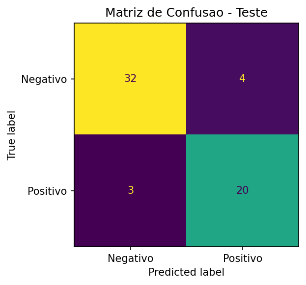
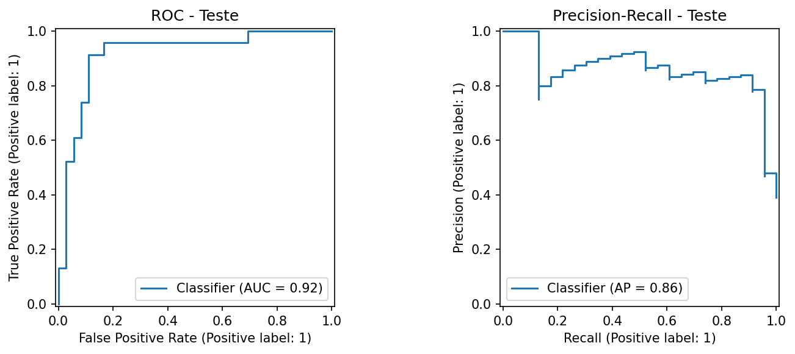

# SpectraAI: Prospecção de Terras Raras a partir de Imagens Multiespectrais ASTER com Aprendizado de Máquina e Visão Computacional

### Autores: Drielly Santana Farias, Eduardo Farias Rizk, Giovanna Fátima de Britto Vieira, Larissa Martins Pereira de Souza, Lucas Ramenzoni Jorge,  Mateus Beppler Pereira, Pedro Auler de Barros Martins

**Instituição:** Instituto de Tecnologia e Liderança (Inteli)
Av. Prof. Almeida Prado, 520 – Butantã – 05508-901 – São Paulo – SP

**E-mails:** {drielly.farias, eduardo.rizk, larissa.souza, giovanna.vieira, lucas.jorge, mateus.pereira, pedro.martins}@sou.inteli.edu.br

## Abstract

This work presents SpectraAI, a reproducible geospatial pipeline that transforms ASTER multispectral imagery into probabilistic indicators of rare earth element (REE) prospectivity. The methodology includes atmospheric filtering, spectral feature engineering, and construction of labeled 128×128×9 image chips. A comparative evaluation using MLP, CNN, and transfer learning with MobileNetV2 shows consistent improvement, with the final model achieving 88.14% accuracy, 0.8511 F1-score, and 0.9167 ROC-AUC. Grad-CAM analysis indicates alignment with geologically relevant patterns.

**Keywords:** remote sensing, ASTER, rare earth elements, deep learning, mineral prospecting.

## Resumo

Este trabalho apresenta o SpectraAI, um pipeline reprodutível que transforma imagens multiespectrais ASTER em indicadores probabilísticos de potencial prospectivo de elementos de terras raras (REE). A metodologia inclui filtragem atmosférica, engenharia de atributos espectrais e construção de chips 128×128×9 rotulados. A avaliação comparativa entre MLP, CNN e transfer learning com MobileNetV2 demonstra melhoria consistente, com o modelo final alcançando 88,14% de acurácia, F1-score de 0,8511 e ROC-AUC de 0,9167.

**Palavras-chave:** sensoriamento remoto, ASTER, elementos de terras raras, aprendizado profundo, prospecção mineral.

## 1. Introdução

&emsp;&emsp;Os Elementos de Terras Raras (Rare Earth Elements — REE) compõem um grupo de 17 elementos amplamente empregados em tecnologias de alto valor agregado, incluindo eletrônica, aplicações industriais avançadas e sistemas energéticos de baixo carbono. A demanda crescente por esses elementos, impulsionada pela transição energética global, tem intensificado preocupações quanto à segurança de suprimento, dado que a produção e o refino permanecem geograficamente concentrados (IEA, 2021; USGS, 2025). Nesse cenário, o Brasil ocupa posição estratégica em virtude de suas reservas expressivas de REE, o que reforça a relevância de métodos eficientes e escaláveis de prospecção mineral. Do ponto de vista operacional, a prospecção mineral tradicional depende de campanhas de campo, amostragem e análises laboratoriais, etapas onerosas e de difícil escalabilidade espacial. Em contrapartida, o sensoriamento remoto oferece um meio de observação sistemática e repetível para apoiar a triagem de alvos, especialmente quando combinado a métodos quantitativos de análise de dados (SABINS, 1999; VAN DER MEER et al., 2012).

&emsp;&emsp;Nesse contexto, o Advanced Spaceborne Thermal Emission and Reflection Radiometer (ASTER) consolidou-se como um dos sensores mais utilizados em mapeamento litológico e exploração mineral, ao disponibilizar bandas espectrais relevantes no VNIR e no SWIR (ABRAMS; YAMAGUCHI, 2019; RAMSEY; FLYNN, 2020). Contudo, a interpretação manual dessas cenas permanece limitada pela alta dimensionalidade espectral e pela sutileza de padrões associados a mineralizações (SHIRMARD et al., 2022). Historicamente, as aplicações de aprendizado de máquina nesse domínio têm sido conduzidas a partir de representações tabulares, descartando a estrutura espacial das imagens. Para superar essa limitação, redes neurais convolucionais (CNN) permitem aprender padrões espaciais e espectrais diretamente a partir de janelas de imagem, preservando relações de vizinhança entre pixels (ZHU et al., 2017).

&emsp;&emsp;Este trabalho apresenta o SpectraAI, um pipeline de ciência de dados geoespaciais que utiliza imagens ASTER e dados de referência fornecidos pela Frontera Minerals para estimar, de forma probabilística, o potencial prospectivo de REE e produzir um ranking de áreas prioritárias para campanhas de pesquisa geológica de campo. As principais contribuições incluem: a construção de um pipeline reprodutível end-to-end; a comparação sistemática entre modelos tabulares (MLP), CNN e transfer learning com MobileNetV2 (SANDLER et al., 2018); e a análise de interpretabilidade via Grad-CAM.

&emsp;&emsp;Especificamente, o trabalho visa:

- **Construir protocolo de engenharia de atributos espectrais** para realce de minerais de alteração hidrotermal a partir de bandas ASTER;
- **Comparar arquiteturas de visão computacional** (CNN) com baselines clássicos (SVM, RF, Regressão Logística) e tabular (MLP);
- **Implementar validação estratificada** com métricas robustas ao desbalanceamento (F1-score, acurácia balanceada, ROC-AUC);
- **Produzir ranking probabilístico** de áreas prospectivas como ferramenta de apoio à decisão em exploração geológica.

## 2. Fundamentação Teórica

&emsp;&emsp;A análise por sensoriamento remoto em geociências fundamenta-se na interação entre radiação eletromagnética e materiais geológicos, em que minerais e rochas exibem respostas espectrais condicionadas por composição e estrutura físico-química. Técnicas clássicas incluem razões de bandas e Análise de Componentes Principais (PCA), frequentemente empregadas para realçar assinaturas diagnósticas de minerais de alteração e discriminar unidades litológicas (ABRAMS; YAMAGUCHI, 2019; ROWAN; MARS, 2003). O sensor ASTER, projetado com subsistemas em VNIR (3 canais, 15 m) e SWIR (6 canais, 30 m), favorece a investigação de características mineralógicas relevantes, tendo contribuído significativamente para mapeamento litológico e exploração mineral ao longo de décadas (ABRAMS; YAMAGUCHI, 2019; RAMSEY; FLYNN, 2020).

&emsp;&emsp;Nos últimos anos, a integração de aprendizado de máquina ampliou o escopo do sensoriamento remoto aplicado à exploração mineral, ao permitir modelar relações não lineares e reduzir a dependência de regras fixas. Pipelines supervisionados capazes de transformar atributos espectrais em classificações quantitativas têm sido propostos, comparando algoritmos clássicos e redes neurais (BAHRAMI et al., 2024). Revisões sobre *mineral prospectivity mapping* com *deep learning* destacam desafios como escassez de rótulos, desbalanceamento de classes e generalização espacial (SUN et al., 2024; SHIRMARD et al., 2022).

## 3. Materiais e Métodos

### 3.1 Materiais

&emsp;&emsp;Os materiais utilizados reúnem dados orbitais, dados de referência geográfica e metadados de rotulagem fornecidos pela Frontera Minerals. A base orbital é composta por cenas ASTER do produto L2 Surface Reflectance VNIR and Crosstalk-Corrected SWIR (AST_07XT) (NASA, [s.d.]), com janela temporal entre 2000 e 2007 para preservar a disponibilidade operacional das bandas SWIR. Foram priorizadas as bandas VNIR (B01, B02, B03N) e SWIR (B04-B09), totalizando nove bandas por chip. As cenas candidatas são recuperadas por caixa geográfica ao redor dos pontos-alvo, com seleção por menor cobertura de nuvens. O material de referência para supervisão é composto por coordenadas georreferenciadas de interesse geológico e listas de códigos positivos e negativos. Após a remoção de amostras com rótulos inválidos, o dataset final contém 295 chips multiespectrais, dos quais 179 pertencem à classe negativa (60,7%) e 116 à classe positiva (39,3%).

### 3.2 Métodos

#### 3.2.1 Aquisição e Pré-processamento

&emsp;&emsp;A base de dados é composta por amostras de solo e rocha coletadas *in situ* pela Frontera Minerals, rotuladas binariamente: classe positiva (áreas com teores acima do *cut-off* econômico) e classe negativa (áreas estéreis ou com teores de base). As assinaturas espectrais foram extraídas de imagens ASTER, priorizando cenas históricas (2000-2007) com cobertura de nuvens inferior a 20% (NASA, [s.d.]). O pré-processamento incluiu filtragem de máscaras (remoção de pixels contaminados por nuvens e vegetação densa), reprojeção para WGS84, cálculo de índices minerais baseados em razões de bandas (como o Índice de Argilas, B06/(B05+B04)) e vetorização para a fase inicial de baselines. O dataset é construído a partir de chips gerados ao redor de pontos georreferenciados, sendo cada chip um GeoTIFF multibanda (128×128×9) com bandas VNIR+SWIR alinhadas. A extração utiliza bounding box com jitter controlado por semente, garantindo variação posicional do ponto de referência dentro do chip.

#### 3.2.2 Modelagem

&emsp;&emsp;O desempenho de referência foi estabelecido por algoritmos clássicos (SVM, Random Forest, Regressão Logística) otimizados via *GridSearchCV* e por uma rede neural densa (MLP) como baseline de deep learning sobre dados vetorizados. Visando superar a limitação da MLP, que ignora a vizinhança espacial, o projeto evoluiu para redes neurais convolucionais (CNN), que recebem o chip em sua forma original (altura × largura × canais), permitindo que filtros convolucionais identifiquem texturas e padrões morfológicos. A arquitetura baseline é composta por dois blocos convolucionais (Conv2D com ReLU, regularização L2 e MaxPooling2D) seguidos por camadas densas de classificação com ativação sigmoid. Para investigar o impacto de escolhas arquiteturais, foram definidas seis configurações em estudo de ablação, variando taxas de dropout, learning rate, profundidade da rede e resolução de entrada.

#### 3.2.3 Protocolo Experimental

&emsp;&emsp;O dataset foi dividido em treinamento (70%), validação (15%) e teste (15%), utilizando amostragem estratificada em duas etapas com a função *train_test_split* do scikit-learn. Essa divisão assegura que a proporção entre classes seja preservada em todos os subconjuntos. A normalização é realizada por padronização z-score por canal espectral, cujos parâmetros são estimados exclusivamente a partir do conjunto de treinamento e aplicados aos conjuntos de validação e teste, evitando vazamento de informação estatística. O conjunto de validação monitora o desempenho ao longo das épocas e identifica sinais de sobreajuste, enquanto o conjunto de teste permanece isolado até a avaliação final. O desempenho é avaliado por F1-score, acurácia balanceada e ROC-AUC, métricas adequadas para cenários com desbalanceamento de classes. Data augmentation (RandomFlip, RandomRotation e RandomContrast) é aplicada exclusivamente ao conjunto de treinamento.

#### 3.2.4 Transfer Learning

&emsp;&emsp;Reconhecendo o tamanho limitado do dataset (N=295), o pipeline incorporou transfer learning com o backbone MobileNetV2 (SANDLER et al., 2018), pré-treinado no ImageNet. Para compatibilizar as 9 bandas ASTER com os 3 canais esperados pelo modelo, uma camada de convolução 1×1 realiza combinação linear das bandas para projeção em espaço latente de 3 canais, preservando a riqueza espectral com apenas ~30 parâmetros adicionais. O treinamento ocorre em duas fases: na primeira (head training, 4 épocas), o backbone permanece congelado e apenas a camada adaptadora e a cabeça de classificação são treinadas; na segunda (fine-tuning parcial, 8 épocas), as últimas 20 camadas do MobileNetV2 são desbloqueadas (exceto BatchNormalization). Grid search sobre learning rates {1e-4, 1e-5} e batch sizes {8, 32} identificou a configuração ótima (LR=1e-4, BS=8).

## 4. Trabalhos Relacionados

&emsp;&emsp;Abrams e Yamaguchi (2019) documentam duas décadas de contribuições do sensor ASTER para mapeamento litológico e exploração mineral, consolidando práticas de razões de bandas e PCA como ferramentas de extração de informação mineralógica. O estudo destaca a configuração espectral do sensor, com seis bandas SWIR e cinco bandas TIR, como determinante para distinguir minerais de alteração hidrotermal (argilas, carbonatos, sulfatos), além de relatar o uso crescente de redes neurais para classificação litológica. Nesse contexto, Rowan e Mars (2003) foram os primeiros a demonstrar a capacidade das 14 bandas ASTER em distinguir litologias e mapear zonas de contato metamórfico associadas a depósitos de REE em Mountain Pass (Califórnia), validando empiricamente a viabilidade dos dados multiespectrais para caracterização mineral em condições de boa exposição superficial.

&emsp;&emsp;Bahrami et al. (2024) investigam mapeamento litológico automatizado com ASTER na região de Sar-Cheshmeh (Irã), comparando RF, SVM, XGBoost e ANN e evidenciando que escolhas de pré-processamento e seleção de atributos espectrais afetam significativamente a qualidade dos resultados, oferecendo um baseline metodológico sólido para comparação entre modelos clássicos e redes neurais. Entretanto, o estudo é orientado a classes litológicas regionais, não sendo desenhado para ranking prospectivo binário nem para generalização a rótulos derivados de coordenadas georreferenciadas. Luo et al. (2025) propuseram o framework DEEP-SEAM v1.0 com Deviation Networks para prospecção semi-supervisionada em dados multifonte, alcançando bom desempenho em cenários com rótulos escassos, mas sem utilizar sensoriamento remoto multiespectral nativo como fonte primária de evidências. Song et al. (2024) aplicaram redes multitarefa a dados geoquímicos tabulares para predição de concentração de REE em cinzas de carvão, demonstrando capacidade de filtrar ruído e capturar correlações não lineares, porém sem explorar informação de imagem ou estrutura espacial. Chen et al. (2014) foram pioneiros em aplicar deep learning com patches espaciais a dados hiperespectrais de sensoriamento remoto, demonstrando ganhos expressivos sobre SVM em abordagem análoga à estratégia de chips do SpectraAI, mas voltada a classificação de uso do solo e não a prospecção mineral com desbalanceamento de classes e rótulos de referência geológica. Shirmard et al. (2022) reforçam que poucos estudos comparam representações tabulares e espaciais sistematicamente sobre o mesmo dataset, lacuna diretamente endereçada pelo pipeline proposto.

## 5. Resultados e Discussão

### 5.1 Comparação de Desempenho

&emsp;&emsp;A Tabela 1 consolida o desempenho das arquiteturas avaliadas (N=295, divisão 70/15/15 estratificada). A progressão é analiticamente reveladora: cada salto corresponde a uma hipótese testada. O MLP (79,66%, F1=0,7391) estabelece o teto da representação tabular — sua limitação não é paramétrica, mas de insumo: ao operar sobre PCA de 2 componentes, descarta a vizinhança espacial, que é o sinal discriminativo central do problema. A CNN (82,44%, ROC-AUC=0,9011) confirma essa hipótese; o estudo de ablação reforça: a remoção das camadas convolucionais colapsa o ROC-AUC de 0,9011 para 0,7083. O transfer learning com MobileNetV2 (84,75%, ROC-AUC=0,9312) demonstra que representações pré-aprendidas no ImageNet capturam estruturas de baixo nível transferíveis para padrões mineralógicos — a convergência em 12 épocas e a redução de 72% em parâmetros treináveis indicam que o ganho vem de melhor inicialização, não de maior capacidade.

Tabela 1 – Comparação consolidada entre arquiteturas no conjunto de teste. Fonte: Autores (2026)

| Modelo | Acurácia | F1-score | ROC-AUC |
|---|---|---|---|
| MLP (tabular + PCA) | 79,66% | 0,7391 | 0,8600 |
| CNN baseline (64×64) | 82,44% | 0,7800 | 0,9011 |
| MobileNetV2 (A08) | 84,75% | 0,8085 | 0,9312 |
| **MobileNetV2 (A11)** | **88,14%** | **0,8511** | **0,9167** |

### 5.2 Modelo Final (Pipeline A11)

&emsp;&emsp;O pipeline final (A11) foi executado de forma integrada e reprodutível (seed=42), com treinamento em duas fases do MobileNetV2 adaptado espectralmente, sobre o dataset completo de 295 chips multiespectrais ASTER (177 treino, 59 validação, 59 teste). O modelo final alcançou acurácia de 88,14%, F1-score de 0,8511 e ROC-AUC de 0,9167 (Tabela 2), convergindo em 13 épocas (6 head + 7 fine-tuning) e 94,4 s de treinamento.

Tabela 2 – Métricas do modelo final (A11) no conjunto de teste. Fonte: Autores (2026)

| Métrica | Valor |
|---|---|
| Acurácia | 88,14% |
| Precisão | 83,33% |
| Recall (Sensibilidade) | 86,96% |
| F1-score | 0,8511 |
| Acurácia Balanceada | 87,92% |
| ROC-AUC | 0,9167 |
| PR-AUC | 0,8588 |
| Épocas totais | 13 (6 head + 7 fine-tuning) |
| Tempo de treinamento | 94,4 s |

&emsp;&emsp;A matriz de confusão (Figura 1) revela que o modelo classificou corretamente 52 das 59 amostras (TN=32, FP=4, FN=3, TP=20). A análise dos erros residuais é tão informativa quanto os acertos: os 3 falsos negativos representam áreas com potencial de REE não detectadas — o erro de maior custo operacional, pois implica oportunidades de prospecção descartadas. Os 4 falsos positivos, por sua vez, correspondem a mobilização de campo em áreas estéreis, cujo custo é recuperável. Essa assimetria justifica o uso conjunto de ROC-AUC e PR-AUC como métricas de avaliação, e sugere que, em contexto operacional, um limiar de decisão levemente abaixo de 0,5 poderia reduzir falsos negativos ao custo de poucos falsos positivos adicionais. As curvas ROC (AUC=0,92) e Precision-Recall (AP=0,86), na Figura 2, corroboram essa flexibilidade: o modelo mantém alta precisão mesmo em regimes de alto recall, o que é essencial para sua aplicação como ferramenta de triagem prospectiva.

*Figura 1. Matriz de confusão do modelo MobileNetV2 final no conjunto de teste (n=59). TN=32, FP=4, FN=3, TP=20.*

*Figura 2. Curvas ROC (AUC=0,92) e Precision-Recall (AP=0,86) do modelo final no conjunto de teste.*

### 5.3 Interpretabilidade via Grad-CAM

&emsp;&emsp;A Figura 3 apresenta mapas de ativação Grad-CAM que visualizam quais regiões espaciais o modelo MobileNetV2 prioriza ao fazer predições. A visualização sobrepõe os mapas de calor a um chip ASTER em falsa cor de uma amostra da classe positiva, comparando as ativações para as predições de cada classe. O mapa da classe positiva revela ativações concentradas em transições espectrais coerentes e bordas espaciais pronunciadas, enquanto o mapa da classe negativa apresenta padrão mais disperso e difuso. Essa concentração não é trivial: ela indica que o modelo aprendeu a distinguir estruturas de alteração hidrotermal — e não artefatos de iluminação ou bordas de cena — como sinal discriminativo, o que é consistente com o conhecimento geológico de que bandas SWIR são sensíveis a óxidos e argilas associados a REE. A convergência entre o comportamento do modelo e o conhecimento de domínio reforça a confiança nas predições e viabiliza sua auditoria por especialistas, condição necessária para adoção operacional do pipeline.

*Figura 3. Mapas de ativação Grad-CAM sobrepostos a chip ASTER em falsa cor (classe real: positiva). À esquerda, imagem original; ao centro, ativação para predição negativa (P=0,527); à direita, ativação para predição positiva (P=0,473), com foco em transições espectrais coerentes.*

### 5.4 Discussão

&emsp;&emsp;Os resultados apontam para três conclusões interligadas. Primeiro, a progressão MLP → CNN → MobileNetV2 reflete a hierarquia de informação do problema: REE em imagens ASTER requerem a combinação de padrões espaciais (zonas de alteração, contatos litológicos) com padrões espectrais (razões SWIR), o que explica a superioridade consistente dos modelos que preservam estrutura espacial. Segundo, o transfer learning demonstra que a escassez de rótulos — principal limitação do domínio — pode ser mitigada por inicialização informada: o ganho de 3,39 p.p. sobre a CNN com 72% menos parâmetros ajustados indica que o gargalo estava no ponto de partida do treinamento, não na capacidade do modelo. Terceiro, o Grad-CAM conecta desempenho quantitativo e interpretação geológica: o modelo aprende representações alinhadas ao conhecimento de domínio, condição necessária para que o ranking probabilístico seja confiável em contexto operacional.

## 6. Conclusão

&emsp;&emsp;O SpectraAI demonstrou que a combinação de representação espacial via CNN, transfer learning com adaptação espectral e interpretabilidade via Grad-CAM constitui uma abordagem metodologicamente sólida para prospecção de REE a partir de imagens ASTER. A progressão de desempenho — do MLP (79,66%) à CNN (82,44%) ao pipeline final A11 (88,14%, F1=0,8511, ROC-AUC=0,9167) — não é apenas uma sequência de melhorias numéricas: cada etapa testou e confirmou uma hipótese sobre a natureza do problema, culminando em um modelo cujos erros residuais (4 FP e 3 FN em 59 amostras) são analiticamente interpretáveis e operacionalmente manejáveis. O produto final — um ranking probabilístico contínuo de áreas por potencial prospectivo — representa uma ferramenta concreta de redução de custos de campo, ao concentrar esforços nas regiões com maior evidência espectral de ocorrência de REE.

### 6.1 Principais Contribuições

&emsp;&emsp;As contribuições do trabalho são: **(i)** a construção de um pipeline reprodutível end-to-end, desde a aquisição de cenas ASTER até a exportação de predições, com controle de seed e separação rigorosa entre conjuntos de dados; **(ii)** a comparação sistemática e controlada entre MLP, CNN e transfer learning sob métricas robustas ao desbalanceamento; **(iii)** a demonstração de que transfer learning com adaptação espectral via convolução 1×1 é viável e eficaz com poucos dados rotulados (N=295); e **(iv)** a análise de interpretabilidade via Grad-CAM, que revelou alinhamento entre regiões ativadas e características espectrais geologicamente relevantes, conferindo transparência às predições. Do ponto de vista prático, o ranking probabilístico de áreas produzido pelo pipeline representa uma ferramenta concreta de apoio à decisão em exploração mineral, capaz de reduzir custos operacionais ao direcionar esforços de campo para regiões com maior probabilidade de ocorrência de REE.

### 6.2 Limitações e Trabalhos Futuros

&emsp;&emsp;Limitações relevantes incluem: o dataset de 295 amostras situa-se no limiar inferior de viabilidade para deep learning; os rótulos derivam de referência geológica sem validação de campo; e a amostragem estratificada aleatória não garante generalização espacial. Como direções futuras, destacam-se validação geológica in situ, validação cruzada espacial, integração multissensor (Landsat-8, Sentinel-2) e investigação de arquiteturas avançadas (ResNet, Transformers).

## 7. Referências

**ABRAMS, M.; YAMAGUCHI, Y.** Twenty Years of ASTER Contributions to Lithologic Mapping and Mineral Exploration. *Remote Sensing*, v. 11, n. 11, art. 1394, 2019. DOI: 10.3390/rs11111394. Disponível em: [https://doi.org/10.3390/rs11111394](https://doi.org/10.3390/rs11111394). Acesso em: 22 fev. 2026.

**BAHRAMI, H. et al.** Machine Learning-Based Lithological Mapping from ASTER Remote-Sensing Imagery. *Minerals*, v. 14, n. 2, art. 202, 2024. DOI: 10.3390/min14020202. Disponível em: [https://doi.org/10.3390/min14020202](https://doi.org/10.3390/min14020202). Acesso em: 24 fev. 2026.

**CHEN, Y. et al.** Deep Learning-Based Classification of Hyperspectral Data. *IEEE Journal of Selected Topics in Applied Earth Observations and Remote Sensing*, v. 7, n. 6, p. 2094–2107, 2014. DOI: 10.1109/JSTARS.2014.2329330. Disponível em: [https://doi.org/10.1109/JSTARS.2014.2329330](https://doi.org/10.1109/JSTARS.2014.2329330). Acesso em: 12 mar. 2026.

**INTERNATIONAL ENERGY AGENCY (IEA).** The Role of Critical Minerals in Clean Energy Transitions. Paris: IEA, 2021. Disponível em: [https://www.iea.org/reports/the-role-of-critical-minerals-in-clean-energy-transitions](https://www.iea.org/reports/the-role-of-critical-minerals-in-clean-energy-transitions). Acesso em: 18 mar. 2026.

**LUO, Z. et al.** An explainable semi-supervised deep learning framework for mineral prospectivity mapping: DEEP-SEAM v1.0. *EGUsphere* (preprint), 2025. DOI: 10.5194/egusphere-2025-3283. Disponível em: [https://doi.org/10.5194/egusphere-2025-3283](https://doi.org/10.5194/egusphere-2025-3283). Acesso em: 23 fev. 2026.

**NATIONAL AERONAUTICS AND SPACE ADMINISTRATION (NASA).** ASTER L2 Surface Reflectance VNIR and Crosstalk-Corrected SWIR (AST_07XT) — Product Description. *NASA Earthdata*, [s.d.]. Disponível em: [https://earthdata.nasa.gov/](https://earthdata.nasa.gov/). Acesso em: 26 fev. 2026.

**RAMSEY, M. S.; FLYNN, I. T. W.** The Spatial and Spectral Resolution of ASTER Infrared Image Data: A Paradigm Shift in Volcanological Remote Sensing. *Remote Sensing*, v. 12, n. 4, art. 738, 2020. DOI: 10.3390/rs12040738. Disponível em: [https://doi.org/10.3390/rs12040738](https://doi.org/10.3390/rs12040738). Acesso em: 26 fev. 2026.

**ROWAN, L. C.; MARS, J. C.** Lithologic mapping in the Mountain Pass, California area using ASTER data. *Remote Sensing of Environment*, v. 84, n. 3, p. 350–366, 2003. DOI: 10.1016/S0034-4257(02)00127-X. Disponível em: [https://doi.org/10.1016/S0034-4257(02)00127-X](https://doi.org/10.1016/S0034-4257(02)00127-X). Acesso em: 26 fev. 2026.

**SABINS, F. F.** Remote sensing for mineral exploration. *Ore Geology Reviews*, v. 14, n. 3-4, p. 157–183, 1999. DOI: 10.1016/S0169-1368(99)00007-4. Disponível em: [https://doi.org/10.1016/S0169-1368(99)00007-4](https://doi.org/10.1016/S0169-1368(99)00007-4). Acesso em: 18 mar. 2026.

**SANDLER, M. et al.** MobileNetV2: Inverted Residuals and Linear Bottlenecks. In: IEEE/CVF CONFERENCE ON COMPUTER VISION AND PATTERN RECOGNITION (CVPR), 2018, Salt Lake City. *Proceedings [...]* . IEEE, 2018. p. 4510–4520. DOI: 10.1109/CVPR.2018.00474. Disponível em: [https://doi.org/10.1109/CVPR.2018.00474](https://doi.org/10.1109/CVPR.2018.00474). Acesso em: 2 abr. 2026.

**SHIRMARD, H. et al.** A review of machine learning in processing remote sensing data for mineral exploration. *Remote Sensing of Environment*, v. 268, art. 112750, 2022. DOI: 10.1016/j.rse.2021.112750. Disponível em: [https://doi.org/10.1016/j.rse.2021.112750](https://doi.org/10.1016/j.rse.2021.112750). Acesso em: 12 mar. 2026.

**SONG, Y. et al.** Predicting rare earth elements concentration in coal ashes with multi-task neural networks. *Materials Horizons*, v. 11, p. 747–757, 2024. DOI: 10.1039/D3MH01491F. Disponível em: [https://doi.org/10.1039/D3MH01491F](https://doi.org/10.1039/D3MH01491F). Acesso em: 23 fev. 2026.

**SUN, K. et al.** A Review of Mineral Prospectivity Mapping Using Deep Learning. *Minerals*, v. 14, n. 10, art. 1021, 2024. DOI: 10.3390/min14101021. Disponível em: [https://doi.org/10.3390/min14101021](https://doi.org/10.3390/min14101021). Acesso em: 26 fev. 2026.

**UNITED STATES GEOLOGICAL SURVEY (USGS).** Interior Department releases final 2025 List of Critical Minerals. *U.S. Geological Survey*, 14 nov. 2025. Disponível em: [https://www.usgs.gov/news/science-snippet/interior-department-releases-final-2025-list-critical-minerals](https://www.usgs.gov/news/science-snippet/interior-department-releases-final-2025-list-critical-minerals). Acesso em: 26 fev. 2026.

**VAN DER MEER, F. D. et al.** Multi- and hyperspectral geologic remote sensing: A review. *International Journal of Applied Earth Observation and Geoinformation*, v. 14, n. 1, p. 112–128, 2012. DOI: 10.1016/j.jag.2011.08.002. Disponível em: [https://doi.org/10.1016/j.jag.2011.08.002](https://doi.org/10.1016/j.jag.2011.08.002). Acesso em: 18 mar. 2026.

**ZHU, X. X. et al.** Deep Learning in Remote Sensing: A Comprehensive Review and List of Resources. *IEEE Geoscience and Remote Sensing Magazine*, v. 5, n. 4, p. 8–36, 2017. DOI: 10.1109/MGRS.2017.2762307. Disponível em: [https://doi.org/10.1109/MGRS.2017.2762307](https://doi.org/10.1109/MGRS.2017.2762307). Acesso em: 18 mar. 2026.