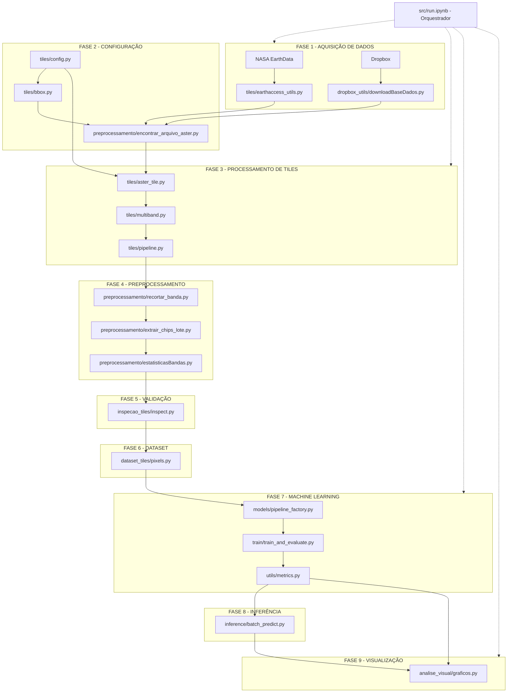

#  Arquitetura SpectraAI - Diagrama de Fluxo

## Fluxo Principal

## Detalhamento dos Arquivos

###  Fase 1 - Aquisição de Dados
| Arquivo | Subpasta | Função |
|---------|----------|--------|
| `earthaccess_utils.py` | `src/tiles/` | Conecta com API NASA EarthData para download de imagens ASTER L1T |
| `downloadBaseDados.py` | `src/dropbox_utils/` | Download e sincronização de dados do parceiro via Dropbox |

###  Fase 2 - Configuração
| Arquivo | Subpasta | Função |
|---------|----------|--------|
| `config.py` | `src/tiles/` | Parâmetros globais: 14 bandas ASTER, wavelengths, subsistemas VNIR/SWIR/TIR, paths |
| `bbox.py` | `src/tiles/` | Define áreas de interesse com coordenadas lat/lon e validação geográfica |
| `encontrar_arquivo_aster.py` | `src/preprocessamento/` | Localiza arquivos ASTER no disco, parsing de diretórios NASA |

###  Fase 3 - Processamento de Tiles
| Arquivo | Subpasta | Função |
|---------|----------|--------|
| `aster_tile.py` | `src/tiles/` | Classe principal para carregar e manipular um tile ASTER com 14 bandas |
| `multiband.py` | `src/tiles/` | Processamento multiespectral: normalização, calibração, índices espectrais |
| `pipeline.py` | `src/tiles/` | Orquestra fluxo completo de processamento em lote de tiles |

###  Fase 4 - Preprocessamento
| Arquivo | Subpasta | Função |
|---------|----------|--------|
| `recortar_banda.py` | `src/preprocessamento/` | Recorte de bandas individuais, resize, conversão GeoTIFF para NumPy |
| `extrair_chips_lote.py` | `src/preprocessamento/` | Extração em lote de chips/patches menores a partir de tiles grandes |
| `estatisticasBandas.py` | `src/preprocessamento/` | Estatísticas das 14 bandas: média, mediana, desvio padrão, min/max |

###  Fase 5 - Validação
| Arquivo | Subpasta | Função |
|---------|----------|--------|
| `inspect.py` | `src/inspecao_tiles/` | Controle de qualidade: detecta anomalias, pixels corrompidos, nuvens |

###  Fase 6 - Dataset
| Arquivo | Subpasta | Função |
|---------|----------|--------|
| `pixels.py` | `src/dataset_tiles/` | Gera dataset pixel-level com labels geológicos, balanceamento de classes |

###  Fase 7 - Machine Learning
| Arquivo | Subpasta | Função |
|---------|----------|--------|
| `pipeline_factory.py` | `src/models/` | Factory de pipelines: SVM, Random Forest, Logistic Regression + StandardScaler |
| `train_and_evaluate.py` | `src/train/` | Treina modelos, split train/test, logging, medição de tempo |
| `metrics.py` | `src/utils/` | Métricas: accuracy, precision, recall, F1, ROC-AUC, MAE, RMSE, R² |

###  Fase 8 - Inferência
| Arquivo | Subpasta | Função |
|---------|----------|--------|
| `batch_predict.py` | `src/inference/` | Predição em lote sobre novos tiles, output GeoTIFF com predições |

###  Fase 9 - Visualização
| Arquivo | Subpasta | Função |
|---------|----------|--------|
| `graficos.py` | `src/analise_visual/` | Gráficos espectrais, mapas de calor, comparação de modelos |

###  Orquestrador
| Arquivo | Subpasta | Função |
|---------|----------|--------|
| `run.ipynb` | `src/` | Pipeline principal end-to-end, importa e executa todos os módulos |